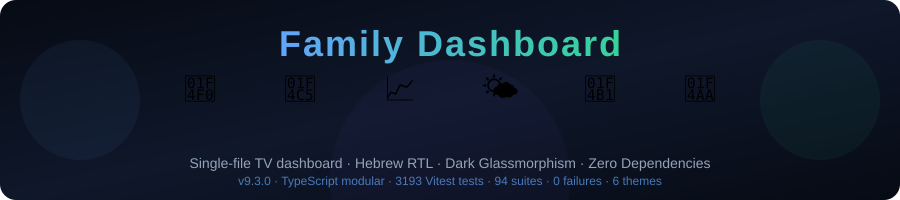
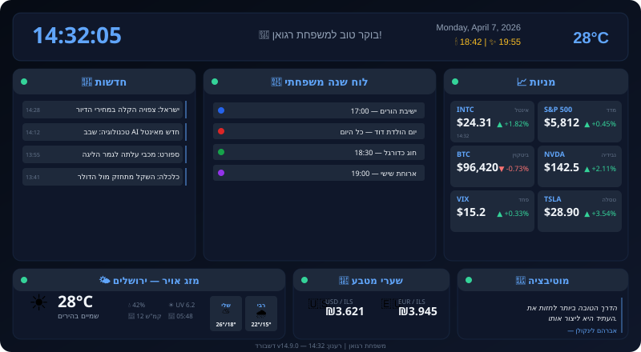
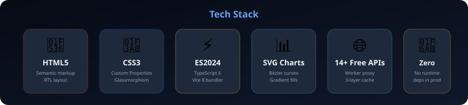
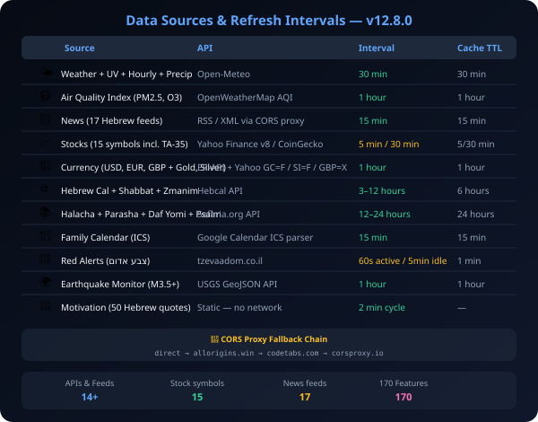
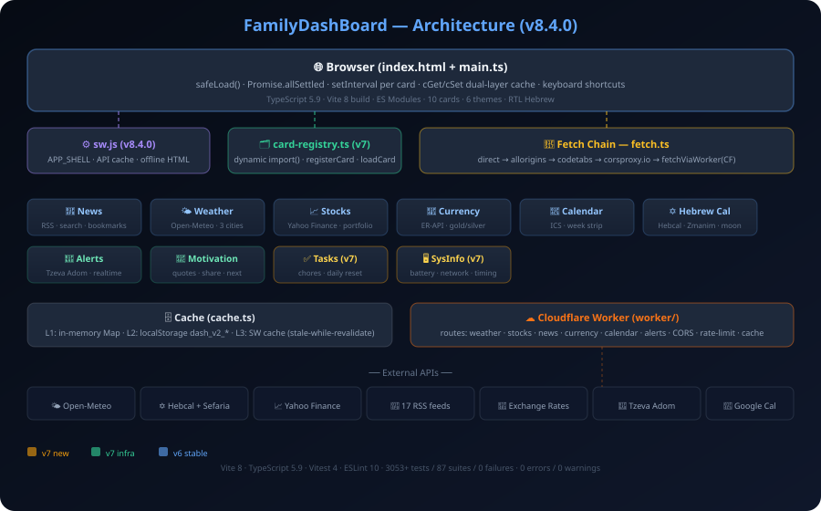

<div align="center">

<picture>
  <source media="(prefers-color-scheme: dark)" srcset=".github/assets/banner.svg">
  <source media="(prefers-color-scheme: light)" srcset=".github/assets/banner.svg">
  
</picture>

<br/>

[](https://github.com/RajwanYair/FamilyDashBoard/actions/workflows/ci.yml)
[](https://github.com/RajwanYair/FamilyDashBoard/actions/workflows/deploy.yml)
[](https://rajwanyair.github.io/FamilyDashBoard/)


[](https://github.com/RajwanYair/FamilyDashBoard/stargazers)
[](https://github.com/RajwanYair/FamilyDashBoard/network/members)
[](https://github.com/RajwanYair/FamilyDashBoard/issues)
[](https://github.com/RajwanYair/FamilyDashBoard/commits/main)
[](https://github.com/RajwanYair/FamilyDashBoard)

**A zero-dependency TypeScript family dashboard for always-on TV display.**<br/>
Dark glassmorphism · 6 themes · Hebrew RTL · 11 cards · Per-pane smart refresh · Drag-and-drop layout · Diagnostic overlay

[Getting Started](#-getting-started) · [Features](#-features) · [Data Sources](#-data-sources) · [Architecture](#%EF%B8%8F-architecture) · [Changelog](#-changelog) · [Contributing](.github/CONTRIBUTING.md)

</div>

---

## 📺 Preview

<div align="center">

</div>

> The dashboard runs full-screen on a 55" TV in the living room with **per-pane smart refresh** (no full-page reloads). Designed for comfortable reading from 3 meters away.

---

## ✨ Features

<table>
<tr>
<td width="50%">

### 📰 Live News

Auto-scrolling Hebrew news from **17 RSS sources** (Ynet, Walla, Mako, Kan, N12, Rotter, Israel Hayom, Globes, Calcalist, Makor Rishon, Kikar HaShabbat, ICE, Geektime, Channel 14, Arutz 7, Srugim, Behadrei Haredim), sorted newest-first with source labels and relative timestamps. Refreshes every **15 minutes**.

### 📅 Family Calendar

Native **ICS parser** fetches Google Calendar data via direct → 3 CORS proxy fallback chain, renders events in a dark-themed agenda view. Falls back to iframe embed if all ICS fetches fail. Refreshes every **15 minutes**.

### 📈 Stock Tracker

**15 live symbols** (INTC, ^GSPC, ^TA35.TA, BTC, NVDA, VIX, TSLA + top-10 S&P500: AAPL, MSFT, AMZN, GOOGL, META, BRK-B, AVGO, JPM) with **company logos**, **smooth bézier SVG charts**, colored per-symbol accents, Yahoo Finance v8/v6 API with proxy fallback, **8-second fetch timeout** (AbortController) to prevent hanging, and a **market open/closed badge** with smart refresh (5 min during market hours, 30 min off-hours). Loaded via `raceProxies()` batch for fastest response.

### 🚨 Red Alerts (צבע אדום)

Live rocket/UAV alerts from the Home Front Command via [tzevaadom.co.il](https://www.tzevaadom.co.il/). Shows 24h count, last 25 events with city names, threat type, and relative time. Active alerts pulse red. Refreshes every **60 seconds** (5 min when idle).

</td>
<td width="50%">

### 🌤️ Weather + UV

Split-panel layout: **right half** shows current conditions (icon + temperature + description), **left half** shows a 2×2 grid of humidity, wind, UV index, and sunrise. Below: a **12-hour temperature curve** and an enlarged **4-day forecast** with bigger icons. Data from Open-Meteo for Jerusalem.

### 💱 Currency Exchange

Live USD/ILS and EUR/ILS rates from open exchange rate APIs with colored trend indicators. GBP removed; layout optimized for 2-item display.

### 🕯️ Shabbat & Holidays

Candle lighting and havdalah times from Hebcal, plus a **holiday countdown** with days-remaining in the header.

### 💪 Motivation

**50 curated Hebrew quotes** with smooth crossfade animation. No network needed — purely static. Cycles every **2 minutes** for continuous TV display.

### ⏱️ Smart Dashboard

- **Per-pane independent refresh** — no full-page reloads
- **Dual-layer cache** (in-memory Map + localStorage) — survives browser restart, 7-day eviction
- **Stale-while-revalidate** — shows cached data instantly, fetches in background
- **5 themes** (OLED black, blue, matrix, amber, purple) — press `T` to cycle
- **3 screen modes** (TV, tablet, phone) — phone mode enables full-page scroll
- **6 card entrance animations** — random direction per card, attention loop every 5min
- **Card maximize** — click any card header to expand it full-screen (FLIP animation), click again or press `Escape` to restore
- **Alerts toggle** — press `A` or use dropdown to show/hide red alerts pane; **off by default**, persisted in localStorage
- **Auto hard-reload every 1h** — picks up HTML file changes without manual browser refresh; defers when tab is hidden
- **Closest sun event** — weather detail shows next upcoming sunrise or sunset based on current time
- **Daily Halacha ticker** — daily halacha from Sefaria.org with reference badge and numbered segments
- **Animated number transitions** — smooth counting effect on temperature, stock prices, and currency values
- **Exponential backoff** — failed API fetches retry with increasing delays
- **GPU/CPU performance** — GPU-accelerated scroll layers, CPU-aware concurrency pool, `scheduleIdle()`, DocumentFragment batch writes
- **Diagnostic overlay** — press `D` for per-pane status + fetch log, auto-opens on errors
- **Offline banner** — slides down when internet is lost, serves stale cache
- **Startup self-check** — validates MOTIVATIONS, DOM refs, PROXIES, STOCK_SYMBOLS
- **Day & year progress bars** in the status bar
- **Blinking clock** with gradient text effect

</td>
</tr>
</table>

---

## 🛠️ Tech Stack

<div align="center">

</div>

---

## 🚀 Getting Started

```bash
# 1. Clone the repo
git clone https://github.com/RajwanYair/FamilyDashBoard.git

# 2. Open in browser — that's it!
open BestDashBoard.html        # macOS
start BestDashBoard.html       # Windows
xdg-open BestDashBoard.html   # Linux
```

> **Tip:** Press **F11** for full-screen TV mode. Press **T** to cycle themes, **D** for diagnostics, **A** to toggle alerts on/off, **Escape** to close a maximized card. Click any card header to expand it full-screen. For hot-reload during development, use VS Code + Live Server extension.

No npm. No build step. No dependencies. Just **one HTML file**.

> **Testing:** Requires Node.js 18+ — run `node --test tests/dashboard.test.mjs` (1084 tests, 61 suites, zero dependencies).

---

## 📡 Data Sources

<div align="center">

</div>

All APIs are free and require no API keys. CORS is handled via a proxy fallback chain (`direct → allorigins.win → codetabs.com → corsproxy.io`). Every response is cached in localStorage with stale-while-revalidate for instant display.

---

## 🏗️ Architecture

<div align="center">

</div>

### Single-File Design

Everything lives in one file — `BestDashBoard.html` — containing:

| Layer | Description |
| ------- | ------------- |
| **HTML** | Semantic structure with RTL Hebrew layout |
| **CSS** | Custom properties, glassmorphism cards, responsive grid, animations |
| **JavaScript** | Async data fetching with proxy fallback, DOM caching, SVG chart generation |

### Key Patterns

```javascript
// ✅ Persistent cache with stale-while-revalidate
const cached = cGet(key, TTL);
if (cached) { render(cached); return; }
const stale = cGetStale(key);
if (stale) render(stale); // show old data while fetching

// ✅ Multi-proxy fallback for CORS
for (const proxy of PROXIES) { /* try each */ }

// ✅ Fetch timeout (prevents hanging on slow proxies)
function fetchWithTimeout(url, ms = 8000) {
    const c = new AbortController();
    const t = setTimeout(() => c.abort(), ms);
    return fetch(url, { signal: c.signal }).finally(() => clearTimeout(t));
}

// ✅ Smooth bézier SVG charts
path += ` C${x1+cp},${y1} ${x2-cp},${y2} ${x2},${y2}`;
```

---

## 📂 Project Structure

```text
FamilyDashBoard/
├── BestDashBoard.html              # The entire dashboard (HTML + CSS + JS)
├── index.html                      # GitHub Pages redirect
├── README.md / CHANGELOG.md        # Documentation
├── SUPPORT.md / LICENSE
├── .editorconfig / .markdownlint.json
├── .gitignore / .gitattributes
├── roadmap.md                          # Refactoring roadmap (R1–R8 sprints)
├── tests/
|   └── dashboard.test.mjs          # 1084 tests, 61 suites (Node.js built-in runner)
├── .github/
│   ├── assets/                     # SVG graphics for docs
│   ├── agents/                     # Copilot custom agents
│   ├── instructions/               # Copilot context files
│   ├── prompts/                    # Reusable Copilot prompts
│   ├── copilot/config.json         # Copilot modes
│   ├── hooks/                      # Git hooks
│   ├── workflows/
│   │   ├── ci.yml                  # Lint + unit tests + security + Lighthouse
│   │   ├── deploy.yml              # GitHub Pages deploy
│   │   ├── release.yml             # Auto-release notes
│   │   ├── auto-label.yml          # PR auto-labeling
│   │   └── dependabot-auto-merge.yml
│   ├── ISSUE_TEMPLATE/             # Bug, feature, API issue forms
│   ├── DISCUSSION_TEMPLATE/        # Ideas, Q&A, show-and-tell
│   ├── CONTRIBUTING.md / SECURITY.md / CODE_OF_CONDUCT.md
│   ├── CODEOWNERS / AGENTS.md
│   ├── dependabot.yml / labeler.yml / release.yml
│   └── copilot-instructions.md
└── .vscode/
    ├── settings.json               # Editor + Copilot + testing config
    └── extensions.json             # Recommended extensions
```

---

## 🎨 Design System

| Token | Value | Usage |
| ------- | ------- | ------- |
| `--bg-primary` | `#060b14` | Page background |
| `--bg-card` | `rgba(15,23,42,0.78)` | Card panels |
| `--accent` | `#60a5fa` | Headers, borders, links |
| `--positive` | `#34d399` | Stock gains, sync OK |
| `--negative` | `#f87171` | Stock losses, errors |
| `--warning` | `#fbbf24` | Shabbat info, loading |
| `--purple` | `#a78bfa` | Accents, stock colors |
| `--pink` | `#f472b6` | Motivation, greeting |
| `--orange` | `#fb923c` | Weather, stock accent |
| `--cyan` | `#22d3ee` | Weather, news accent |
| `--text-primary` | `#f1f5f9` | Main text |
| `--text-secondary` | `#94a3b8` | Secondary labels |

Cards use `backdrop-filter: blur(16px)` for the glassmorphism effect. All animations use `ease-out` with staggered delays.

---

## 🏷️ Topics & Keywords

`dashboard` `family-dashboard` `tv-display` `smart-home` `hebrew` `rtl` `israel`
`glassmorphism` `single-file` `zero-dependencies` `vanilla-javascript` `html5` `css3`
`weather` `stocks` `news-reader` `dark-theme` `real-time` `github-pages` `open-source`

> These topics are set on the [GitHub repository](https://github.com/RajwanYair/FamilyDashBoard) for discoverability.
> Search GitHub for [`topic:family-dashboard`](https://github.com/topics/family-dashboard) or [`topic:tv-display`](https://github.com/topics/tv-display) to find this project.

---

## 📋 Changelog

See [CHANGELOG.md](CHANGELOG.md) for the full version history. Summary in the [Roadmap](#%EF%B8%8F-roadmap) section above.

---

## 🏗️ GitHub Integration

This project leverages extensive GitHub features:

| Feature | Details |
| --------- | --------- |
| **GitHub Pages** | [Live demo](https://rajwanyair.github.io/FamilyDashBoard/) auto-deployed from `main` |
| **GitHub Actions** | 5 workflows — CI, deploy, release, auto-label, dependabot-auto-merge |
| **Issue Templates** | YAML forms for bugs, features, API issues with auto-labeling |
| **Discussion Templates** | Ideas, Q&A, Show-and-Tell categories |
| **Dependabot** | Weekly updates for GitHub Actions dependencies |
| **Copilot Integration** | 2 custom agents, 4 skills, 3 prompts, 3 instruction files |
| **Community Health** | CODE_OF_CONDUCT, CONTRIBUTING, SECURITY, SUPPORT, CODEOWNERS |
| **Auto Release Notes** | 8-category changelog via `release.yml` |

---

## 🗺️ Roadmap

> Each release ships `BestDashBoard.html` attached to the GitHub Release and live on GitHub Pages. No build artifacts — the HTML file IS the deliverable.

### Completed

| Version | Summary |
| --------- | --------- |
| v3.0–v4.4 | Glassmorphism redesign, red alerts, per-pane refresh, 5 themes, diagnostic overlay |
| v4.5–v4.8 | Card maximize, halacha ticker, 17 news feeds, Hebrew Calendar card, stock logos |
| v4.9 | Sprints 1–5 (F1–50): Parasha, Zmanim, Daf Yomi, config panel, AQI, Gold/Silver, sparklines |
| v4.10 | Sprints 6–7 (F51–70): TA-35, portfolio P&L, earthquake monitor, market countdown |
| v4.11 | Sprint 8 (F71–80): GBP, favicons, sector headers, Shabbat pill, PWA metas |
| v4.12 | Sprint 9 (F81–90): 7-day forecast, ICS config, dim schedule, offline cache age |
| v4.13 | Sprint 10 (F91–100): SW offline, home city, news feed toggle, card drag-reorder |
| v4.14 | Sprint 11 (F101–110): Multi-ICS, news search, settings import/export, visited news |
| v4.15 | Sprint 12 (F111–120): API cache, notifications, weather cities, config tabs |
| v4.16 | Sprint 13 (F121–130): Toast system, UV pill, chart toggle, deeplinks |
| v4.17 | Sprint 14 (F131–140): Stock alerts, P&L chip, weather toast, countdown chip |
| v4.18 | Sprint 15 (F141–150): Dew point, bookmarks, weather summary, help overlay |
| v4.19 | Sprint 16 (F151–160): Omer, sparklines, card collapse, halacha overlay |
| v5.0 | Sprint 17 (F161–170): Corp proxy, SW v5, PWA install, offline fallback |
| v5.1 | Refactoring R1–R5: CSS tokens, ARIA, JS constants, dead code removal |

### Upcoming

| Version | Summary | Status |
| --------- | --------- | -------- |
| v5.2 | Web Push notifications for red alerts | 🔜 |
| v5.3 | Refactoring R6–R8: Calendar/Alerts/Motivation cleanup | 🔜 |
| v5.4 | Card drag-reorder (long-press header) | 💡 |
| v5.5 | Family photo slideshow + transit departures | 💡 |

> **Release convention:** Every version bump commits `BestDashBoard.html`, updates `CHANGELOG.md`, bumps the badge in `README.md`, tags `vX.Y.Z`, and pushes. GitHub Actions auto-releases + deploys.

---

## 🤝 Contributing

See [CONTRIBUTING.md](.github/CONTRIBUTING.md) for development setup and coding standards.

**Quick rules:**

- Use CSS custom properties — never hardcode colors
- Use `textContent` — never `innerHTML` with external data
- Keep it zero-dependency — no npm, no frameworks
- Test RTL layout + full-screen TV mode

---

## 📄 License

MIT © [RajwanYair](https://github.com/RajwanYair)

---

<div align="center">

Built with ❤️ for the Rajwan family

<sub>Designed for a 55" TV in the living room · Always on · Always updated</sub>

</div>
