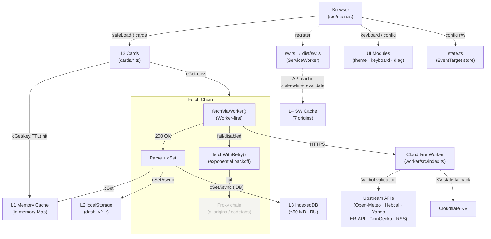
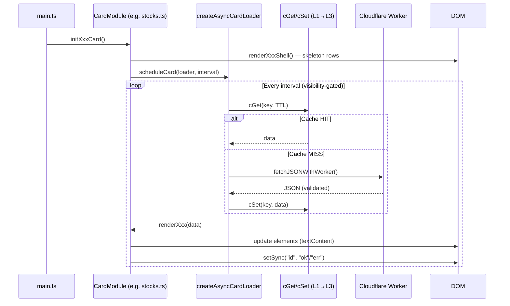
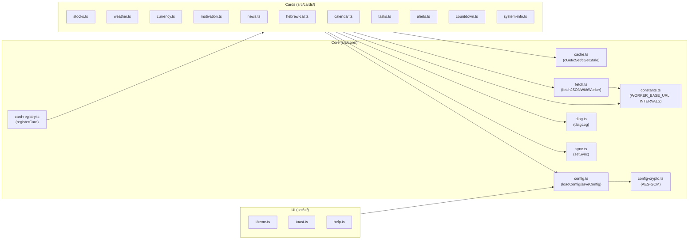

# FamilyDashBoard — Architecture (v13.31.0)

> Deployment: <https://rajwanyair.github.io/FamilyDashBoard/>
> Worker: <https://fdb.rajwanyair.workers.dev>

Canonical doc entry points: [README.md](../README.md), [docs/README.md](README.md), and [docs/adr/README.md](adr/README.md). The archived `BestDashBoard.html` artifact is not part of the current runtime architecture.


## Stack

| Decision         | Choice                                                                                                     | Rationale                                                     |
| ---------------- | ---------------------------------------------------------------------------------------------------------- | ------------------------------------------------------------- |
| Build tool       | **Vite 8**                                                                                                 | Fast dev server, Rollup bundler, native TS, tree-shaking      |
| Language         | **TypeScript 6.0.3**                                                                                       | Type safety, type-aware ESLint, strict null checks            |
| Test framework   | **Vitest 4.1.5 + happy-dom 20**                                                                            | Vite-native, real DOM simulation, 5980 tests / 179 suites     |
| Lint             | **ESLint 10 + typescript-eslint 8**                                                                        | Flat config, type-aware rules, 0 errors / 0 warnings enforced |
| API proxy        | **Cloudflare Workers**                                                                                     | Eliminates CORS chain, 100 K req/day free, edge-deployed      |
| Deployment       | **GitHub Pages** (static) + **Cloudflare Workers** (API)                                                   |                                                               |
| CSS approach     | **Vanilla CSS** with `@layer`, design tokens, `color-mix()`                                                | No preprocessor; cascade-aware; container queries             |
| Module format    | **ES Modules** native `import`/`export`                                                                    |                                                               |
| npm model        | Tools installed at parent **`MyScripts/`**; shared configs vendored into `tooling/`; no local lock file    | Single-root install for all scripts in the monorepo           |
| CI               | `.github/ci/install-tools.sh` — no `npm ci` or lock file needed; `tooling/` is self-contained              |                                                               |
| Tooling ESLint   | `tooling/eslint/web-ts-app.mjs` (browser TS) · `node-ts-app.mjs` (Node/Worker) · `js-browser-app.mjs` (JS) | Shared factory functions; project-specific overrides only     |
| Tooling Vitest   | `tooling/vitest/base.mjs` · `happy-dom.mjs` (DOM) · `node.mjs` (server)                                    | Layered presets; projects extend the relevant preset          |
| Tooling tsconfig | `tooling/tsconfig/base-typescript.json` (browser/bundler) · `base-node.json` (Node/Worker)                 | All TS projects extend one of these bases                     |

## File Structure

```text
src/
├── index.html                  # App shell HTML (RTL, Hebrew)
├── main.ts                     # Startup: 3-tier priority init (HIGH/NORMAL/LOW via requestIdleCallback), intervals
├── types/
│   ├── api.ts                  # API response shapes (weather, stocks, news…)
│   ├── config.ts               # User config schema + defaults
│   └── card.ts                 # CardDefinition, CardSlot, CardRegistryEntry (v7)
├── core/
│   ├── constants.ts            # URLs, symbols, intervals, WORKER_BASE_URL
│   ├── cache.ts                # cGet/cSet/cGetStale/cGetAsync/cGetStaleAsync — in-memory Map + localStorage (dash_v2_*)
│   ├── idb-cache.ts            # IDB L3 tier — idbGet/Set/Del/Clear/Keys/GetEntry/EstimateSize/EvictLRU (50 MB LRU cap)
│   ├── fetch.ts                # fetchWithTimeout · proxy chain · __USE_PROXIES__ gate · fetchViaWorker · fetchWithRetry (backoff) · network state tracker
│   ├── state.ts                # EventTarget-based reactive pub/sub store — state.get/set/on/off/seedConfig/snapshot
│   ├── error-reporter.ts       # Debounced client error batching → POST /api/errors (best-effort telemetry)
│   ├── error-tracker.ts        # Window error/unhandledrejection listeners, error bucketing
│   ├── signals.ts              # Zero-dep reactive primitives: signal/computed/effect/batch/untrack/isSignal (TC39 Signals API mirror, ADR-038, v13.9)
│   ├── fs-access.ts            # Native File System Access: saveTextFile/pickTextFile with showSaveFilePicker fallback → blob-anchor (v13.10)
│   ├── card-registry.ts        # Map-based card registry, lazy dynamic import() (v7)
│   ├── fdb-card.ts             # FdbCard base class implementing CardRuntime interface (v7.13)
│   ├── diag.ts                 # diagLog() + diagnostic overlay
│   ├── config.ts               # Settings load/save/export/import — migrateConfig() · sanitize() (v7.4)
│   ├── sync.ts                 # setSync(id, state) — sync dots + health
│   ├── idle.ts                 # scheduleIdle(), requestIdleCallback wrapper; pageVisibleSignal: ReadonlySignal<boolean> (v13.10)
│   ├── perf.ts                 # Performance timing helpers + mark/measure wrappers + card init timing (v7.19)
│   ├── provider.ts             # Per-provider health tracking: success/failure counts + latency histogram (v7.19)
│   ├── utils.ts                # Shared utility functions (formatters, helpers)
│   ├── hardware.ts             # getHardwareProfile() — CPU/RAM/GPU tier detection, applyHardwareTier()
│   ├── sw-constants.ts         # SW version/cache name constants shared between sw.ts and src/
│   ├── sw-register.ts          # SW registration + SKIP_WAITING + VERSION_ACTIVATED + 10s auto-reload countdown + 60min periodic update
│   ├── event-bus.ts            # Signals-based pub/sub channels: globalSync/globalAlertChannel/globalThemeChannel/globalOffline (Sprint 173 / X2)
│   ├── links.ts                # Semantic-link service: register/resolve cross-card links, gated by semanticLinksEnabled (Sprint 216 / X3)
│   ├── history.ts              # Generic ring-buffer helpers: historyAppend/historyGet/sparklineSvg — used by alerts, system-info, weather
│   └── snapshot.ts             # Dashboard snapshot export: buildSnapshot() / downloadSnapshot() — wired to Ctrl+Shift+S (Sprint 258 / X8)
├── ui/
│   ├── theme.ts                # 6-theme system: black·blue·matrix·amber·purple·rose
│   ├── keyboard.ts             # All keyboard shortcuts (T/D/A/S/N/+/-/P/B/H/C/Esc)
│   ├── maximize.ts             # Card maximize/FLIP + collapse (startViewTransition)
│   ├── scroll.ts               # Scroll loop helpers + GPU keyframe injection
│   ├── header.ts               # Clock, greeting, market badge, birthday/countdown chips
│   ├── ticker.ts               # Halacha/Daf ticker bar
│   ├── status-bar.ts           # Version, sync dots, progress bars
│   ├── night-dimmer.ts         # Night dim overlay with schedule (dash_v2_dim_start/end)
│   ├── bg-images.ts            # Background image rotation (HTTPS-only, 30-min crossfade)
│   ├── config-panel.ts         # Settings panel (save, export, import, shareSettings)
│   ├── diag-overlay.ts         # Diagnostics <dialog> (migrated from <div>, v7)
│   ├── screen-mode.ts          # Screen mode manager (normal/compact/theater)
│   ├── layout-drag.ts          # Drag-and-drop card reordering with localStorage persistence
│   ├── toast.ts                # Toast notification system
│   ├── today-pane.ts           # Unified Today strip: aggregates alert/countdown/tasks/stocks/calendar signals (Sprint 190 / X1)
│   ├── offline-banner.ts       # Global offline indicator driven by globalOffline signal (Sprint 174 / X6)
│   └── help.ts                 # Help <dialog> modal auto-generated from keyboard registry
├── cards/
│   ├── base-card.ts            # createCardLoader() + scheduleCard() — shared lifecycle
│   ├── news/news.ts            # RSS feeds + search + bookmarks + stale tinting + pub-time/elapsed display
│   ├── weather/weather.ts      # Open-Meteo, multi-city tabs, UV, sky, precipitation
│   ├── stocks/stocks.ts        # Yahoo Finance, portfolio P&L, alerts, market countdown
│   ├── currency/currency.ts    # Exchange rates + gold/silver
│   ├── calendar/calendar.ts    # ICS parser + week strip + countdown (Worker-first fetch)
│   ├── hebrew-cal/hebrew-cal.ts # Hebcal API, Zmanim, moon phase, psalm, chores
│   ├── alerts/alerts.ts        # Tzeva Adom (Red Alert), realtime mode
│   ├── motivation/motivation.ts # Rotating quotes with share
│   ├── tasks/tasks.ts          # Family chore board (v7, localStorage, daily reset)
│   ├── countdown/countdown.ts  # Countdown timers to user-defined events (v7.1)
│   ├── system-info/system-info.ts # Battery, network, timing, browser info (v7)
│   └── video-news/             # Live streaming news channels (C14, i24, etc.)
├── styles/
│   ├── tokens.css              # @layer tokens: design tokens, @layer order declaration
│   ├── themes.css              # 6 theme overrides + auto-theme hooks
│   ├── base.css                # Reset, typography, body, scrollbar
│   ├── layout.css              # 3-column grid, @container queries, drag-drop styles
│   ├── components.css          # Cards, headers, badges, SW update banner, dialogs
│   ├── animations.css          # Keyframes, transitions, entrance effects
│   ├── scroll.css              # Scroll containers, GPU layers, fade masks
│   ├── maximize.css            # Card maximize + collapse animations
│   ├── screen-modes.css        # Compact / theater mode overrides
│   ├── print.css               # @media print
│   ├── sprints.css             # Cross-cutting global styles (season tints, elec badge, clock)
│   └── a11y.css                # prefers-reduced-motion, prefers-contrast
worker/src/
│   ├── index.ts                # Worker entry + router (re-exports Env from types.ts)
│   ├── types.ts                # Env interface (KV, secrets) — canonical, no circular deps (ADR-015)
│   ├── routes/
│   │   ├── data.ts             # weather · currency · hebcal · hebcal/holidays (KV stale)
│   │   ├── feeds.ts            # stocks · news · alerts · calendar · sefaria · crypto (KV stale)
│   │   ├── ai.ts               # GET /api/news/summarise · /api/motivation/hebrew (AI_ENABLED gate, ADR-030)
│   │   └── errors.ts           # POST /api/errors — client error ingestion (best-effort telemetry)
│   ├── utils/
│   │   ├── response.ts         # jsonResponse() · proxyResponse() · CORS_HEADERS
│   │   ├── allowlists.ts       # ALLOWED_NEWS_ORIGINS · ALLOWED_CALENDAR_ORIGINS
│   │   └── kv.ts               # kvGetStale<T>() · kvPut() — shared KV helpers (ADR-013)
│   └── middleware/             # rate-limit · cors · cache-control (v7.5)
├── wrangler.toml
└── package.json
tests/unit/
├── core/                       # cache · fetch · config · constants · diag · sync · sw · state · idb-cache · error-reporter · hardware
├── cards/                      # all 12 card modules
├── ui/                         # theme · header · keyboard · maximize · night-dimmer …
├── tests/unit/worker/          # cors · rate-limit · validation · allowlists · response · errors routes · ai routes
└── html/dom-contract.test.ts   # Element ID existence contract tests
```

## Runtime Architecture

```text
Browser
 ├─ main.ts ─── safeLoad(each card) ──► Promise.allSettled
 │               └── setInterval per card (TTL-based refresh)
 ├─ sw.ts → dist/sw.js ── APP_SHELL pre-cache ─► offline HTML fallback
 │               └── API cache (7 origins, 7-day TTL stale-while-revalidate)
 └─ card-registry.ts (v7)
     └── dynamic import() per card ──► lazy load + init

Fetch chain (per request):
  cGet(key, TTL) → hit: return cached
                 → miss: fetchViaWorker (Cloudflare, v7.5) ← Worker-first path
                       → fallback: fetchWithRetry(url)   ← exponential backoff (v7.4)
                           → inner chain: fetchWithTimeout(direct)
                           → __USE_PROXIES__ gate (v7.10: false in production)
                           → fallback: allorigins proxy
                           → fallback: codetabs proxy
                           → fallback: corsproxy.io
                 → cSet(key, data)
                 → recordFetchSuccess / recordFetchFailure (network state, v7.4)

Cache layers:
  L1: in-memory Map (process lifetime)
  L2: localStorage (dash_v2_*, 7-day eviction)
  L3: IndexedDB (async, ≤ 50 MB LRU cap via idbEvictLRU, v7.10)
  L4: Service Worker cache (API endpoints, stale-while-revalidate)
```

## Data Flow — Mermaid Overview



## Card Lifecycle — Mermaid Overview



## Core Module Dependencies — Mermaid Overview



## CSS Architecture (v7.7)

```css
@layer tokens, themes, base, layout, components, animations;
/* Declared in tokens.css — explicit layer ordering prevents specificity wars */

/* Derived tokens using color-mix() */
--accent-subtle: color-mix(in oklch, var(--accent) 20%, transparent);
--bg-overlay: color-mix(in oklch, var(--bg-card) 85%, transparent);

/* Container queries on cards */
.card {
  container-type: inline-size;
}
@container (max-width: 320px) {
  .card-title {
    font-size: 0.85rem;
  }
}
```

### CSS Co-location Rule (v7.5+)

Each UI component owns its CSS file — co-located next to the TypeScript file:

```text
src/ui/config-panel.ts     ← imports
src/ui/config-panel.css    ← component-scoped styles

src/ui/toast.ts            ← imports
src/ui/toast.css           ← component-scoped styles
```

Card CSS works identically:

```text
src/cards/weather/weather.ts   ← imports
src/cards/weather/weather.css  ← weather-only styles
```

Global styles (tokens, layout, animation) remain in `src/styles/`.

## Key Invariants

1. **No external JS/CSS libraries** — zero runtime CDN dependencies
2. **No hardcoded colors** — all via CSS custom properties (`--accent`, `--bg-card`, etc.)
3. **No `innerHTML` with unsanitized data** — use `textContent` or `createElement`
4. **All async loaders**: `safeLoad()` + `if (!_pageVisible) return;` guard
5. **All fetches**: try/catch + proxy chain (`PROXIES`) + `diagLog()` + network state tracking
6. **All API data**: `cSet`/`cGet`/`cGetStale` dual-layer cache
7. **DOM refs in `el` object** — no repeated `getElementById`
8. **0 ESLint errors/warnings** enforced on every commit (CI gate)
9. **0 TypeScript errors** enforced (`tsc --noEmit` in CI)
10. **No `eslint-disable` / `@ts-ignore` suppressions** — violations must be fixed
11. **Config validated on load** — `migrateConfig()` + `sanitize()` via type guards (v7.4); v4 schema namespaces per-card settings under `cards: Record<string, CardConfig>` (v7.10)
12. **`__APP_VERSION__`** injected from `package.json` at build time — version is single source of truth
13. **Card CSS co-located** — each card and UI component imports its own `.css` file; `sprints.css` for cross-cutting globals only (v7.5+)
14. **Worker-first fetch** — `fetchViaWorker()` is the primary data path when `isWorkerEnabled()`; proxy chain is fallback-only (v7.5); `__USE_PROXIES__=false` disables proxy chain in production builds (v7.10)
15. **5957 tests / 175 suites / 0 failures** — coverage thresholds: 93.0% statements, 84.6% branches, 92.0% functions, 94.5% lines (v13.31.0)
16. **Reactive state store** — `state.ts` EventTarget pub/sub for `config`/`cache`/`ui` slices; `window.__FDB_STATE__` DevTools hook in DEV (v7.10)
17. **Error telemetry** — `error-reporter.ts` batches runtime errors, POSTs to Worker `POST /api/errors`; Worker logs to CF console (best-effort, v7.10)
18. **Domain types** — `WeatherDomain`, `StocksDomain`, `CurrencyDomain`, `NewsDomain`, `AlertsDomain`, `HebcalDomain`, `CalendarDomain` normalize provider quirks; mapper functions live in each card module (v7.13)
19. **CardRuntime interface** — `src/types/card.ts` defines `CardRuntime` contract (render/connect/disconnect/refresh/onConfigChange); `FdbCard` base class implements foundation (v7.13)
20. **Provider health model** — `src/core/provider.ts` tracks per-provider success/failure counts + latency histogram; `getProviderHealth(id)` exposed in diagnostic overlay (v7.14, extended v7.19)
21. **Config import validation** — `validateImportedConfig(raw)` in `src/core/config.ts` guards against malformed or mismatched schema versions on import (v7.13)
22. **Per-card configSchema** — Each card exports a `CardConfigField[]` schema; `buildConfigAccordion()` auto-renders the config panel UI; per-card reset buttons (v7.19, ADR-004)
23. **Config dirty tracking** — `closeConfigPanel()` warns on unsaved changes; second close discards (v7.19)
24. **Observability suite** — Card init timing (`recordCardInitTime`), startup waterfall in diag overlay, perf JSON export, error rate trending sparkline, network quality history (v7.19)

## Accessibility Compliance

FamilyDashBoard targets **WCAG 2.2 AA** with select Level AAA criteria. The following notes document the implementation decisions for auditors.

### WCAG 3.3.7 — Redundant Entry (Level A, WCAG 2.2)

**Requirement**: Information previously entered by the user that is required to be entered again must be auto-populated or available for selection.

**Implementation**: The config panel (`src/ui/config-panel.ts`) reads all settings from `localStorage` via `config.ts` and pre-fills every `<input>`, `<select>`, and `<textarea>` on open. Users never need to re-enter the same value twice:

- City / location fields are pre-filled from `cards.weather.city` / `cards.weather.lat` / `cards.weather.lon`.
- Stock symbols, calendar URLs, and task lists are pre-filled from their respective `cards.*` namespace keys.
- The config import/export feature (`validateImportedConfig`) allows full restore from a JSON backup — eliminating re-entry entirely.

No multi-step forms exist in this dashboard. All settings are presented on a single config panel loaded from the persisted store.

### WCAG 2.4.6 — Headings and Labels (Level AA)

A visually-hidden `<h1 id="page-heading">` is injected inside `<main>` (Sprint 30). Screen readers announce the page title without affecting the visual TV layout. The `.sr-only` CSS utility follows the [WebAIM SR-only pattern](https://webaim.org/techniques/css/invisiblecontent/) with `clip: rect(0,0,0,0)`.

### WCAG 3.2.6 — Consistent Help (Level A, WCAG 2.2)

The `?` / `H` keyboard shortcut opens the help modal (`src/ui/help.ts`) from any page state. The shortcut is documented in:

- The help modal header itself.
- The keyboard shortcut list rendered in the help modal (`H` / `?` → help).
- The config panel footer ("Press `?` for keyboard shortcuts").

The help entry point is consistent across all overlay states (config, diagnostics, alerts).
