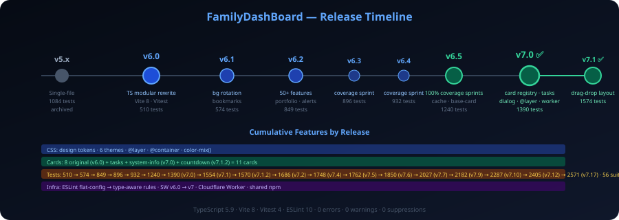

# FamilyDashBoard — Strategic Roadmap (Deep-Rethink v3.1)

> **Refresh date**: 2026-05-17 · **Shipped baseline**: v14.24.0 · **Active stream**: V15-OPEN.
>
> **v3.1 audit stamp (2026-05-16)**: Full re-litigation pass confirms zero divergence from v3 strategy. Inventory verified: 0 dead exports (142 files scanned via `check-dead-exports`), 0 `eslint-disable` / `@ts-ignore` / `@ts-expect-error` / `@ts-nocheck` in `src/`, 0 `continue-on-error` in workflows, 0 suspended/disabled CI gates (v13.x hardening sweep remains intact). All current `disabled` symbols in source are legitimate user-config semantics (`disabledFeeds`, HTML `[disabled]`, `0 = disabled` interval encodings, `ai_disabled` Workers AI opt-in flag, `video-news` opt-in default). Webhint IE compat false-positives in `.hintrc` resolved (IE EOL 2022, excluded by `.browserslistrc` since v9). Root layout left intact — Vite/Vitest/ESLint/TS/Playwright config files at root is the ecosystem convention; relocation gains nothing and forces CLI flags into every npm script, CI workflow, and operator doc. v15.0.0 reserved for the V15-OPEN feature stream (§6.1–6.6) — not consumed by structural reset. Next published version when V15-OPEN ships an exit-gate item; cleanup-only releases use patch tags.
>
> **Inventory**: 7517 tests / 308 suites / 0 failures · 0 lint errors · 0 lint warnings · 0 `eslint-disable` · 0 `@ts-ignore` · 81 ADRs · 0 client deps · 2 worker deps (Hono + Valibot) · 7 themes · 12 cards · 4-tier offline cache · Worker ≤ 75 KB gzip · LHCI perf `error 0.99` · SLSA L2 + Sigstore + rebuilder manifest.
> **Coverage**: 96.44 / 89.70 / 95.81 / 97.41 (statements / branches / functions / lines).
>
> **Purpose**: a forward-looking, first-principles plan. Every paragraph is a decision, gate, or trigger. Historical sprints live in [CHANGELOG.md](../CHANGELOG.md) — this file is **what's next, only**.
>
> **Bar**: best-in-class for an always-on family TV dashboard, harvested by direct comparison against the best peer in each category, no grandfathering of past decisions, no decoration.

---

## 0. Executive Summary

After 400+ sprints across v10 → v14.24 the project sits on a stable, opinionated, production-hardened plateau. SETTINGS, CARD synergies (X1–X15), and the per-card depth backlog are **shipped**. The quality gate is industry-leading for a static-PWA: 7517 tests / 308 suites, 95 fast-check property test files across 4 domains (core / cards / ui / worker), container-query-only audit, mermaid validator, reading-level gate, smart-contrast audit, vendor-neutrality drill active.

This v3 rethink re-opens **every** major decision made since v10 — language, architecture, tooling, dependencies, documentation, infrastructure, APIs, testing, deployment, security — and benchmarks each against the best-in-class peer in its category. The result is a consolidated plan where nothing is grandfathered.

### 0.0 The Six Strategic Pillars (v15 → v17)

1. **Replace heuristics with semantics** — Vectorize embeddings (news dedup); TC39 Temporal once polyfill ≤ 10 KB; TC39 Signals one-line swap once ≤ 1.5 KB; on-device WebNN inference for motivation/news where it preserves zero-PII.
2. **Push observability + supply chain to industry leadership** — SLSA L3 hermetic builds, opt-in OpenTelemetry from Worker, Cloudflare Snippets / TEE audit, third-party rebuilder verification, automated SBOM diff.
3. **Cross-device continuity without auth or DB** — WebRTC mirror with QR pairing (gated, ADR-049), CRDT (Yjs ≤ 12 KB) only if WebRTC delta proves insufficient, opt-in Web Push for alerts on phone (Cloudflare Workers VAPID).
4. **Resilience behind hostile networks** — preserve `?nosw=1`, corp-CSP allowlist, file-protocol launch; layer in Compute Pressure API, Storage Buckets, Origin-Agent-Cluster.
5. **Agentic dashboard** — expose the dashboard as an MCP server (read-only) so users' AI assistants can query "what's on today" without scraping. Privacy boundary: localhost-only, no cloud egress.
6. **Mono-repo harvest** — promote `tooling/` presets to BudgetManager / CrossTideWeb / Wedding so all four repos share one quality gate.

### 0.1 Engineering Discipline (Non-Negotiable)

Five meta-rules that override all feature pressure. Sourced from the project's genesis quality directive; reaffirmed at every major release.

1. **No suppression, waivers, or workarounds.** Fix root causes. If genuinely unavoidable, document in an ADR with a production-safe rationale — never just disable a check.
2. **No suspended / disabled / deprecated / commented-out code in production.** If it exists for a real reason, it belongs to the correct production approach with an ADR. If not, delete it.
3. **No dead artifacts.** Dead code, dead docs, dead configs, unused scripts, stale examples — remove them. Everything in the repository must be wired, coherent, and current.
4. **Reproducibility first.** Deterministic builds (SHA-pinned Actions), pinned tool versions, documented setup steps, and an annual third-party rebuilder drill (D15 — see §6.5).
5. **Forward-only history.** This document records only what is _next_. Completed work is deleted from here and moved to `CHANGELOG.md`.

---

## 1. Full First-Principles Re-Litigation (2026-Q2 · v3 refresh)

Stamps: **Keep**, **Adopt**, **Replace**, **Defer**, **Reject**, **Track**, **Supersede**.

Every decision below is re-opened from zero. Prior verdicts carry no momentum.

### 1.1 Code language & TypeScript posture

| Decision                                                                                               | Verdict                  | Rationale / Action                                                       |
| ------------------------------------------------------------------------------------------------------ | ------------------------ | ------------------------------------------------------------------------ |
| TypeScript strict + `noUncheckedIndexedAccess` + `verbatimModuleSyntax` + `exactOptionalPropertyTypes` | **Keep (load-bearing)**  | Annual posture review only. Rust → WASM rejected (bundle floor 150 KB+). |
| TypeScript 6.0.3                                                                                       | **Keep**                 | Track 6.1+ on parent `MyScripts/`.                                       |
| TypeScript 7 (Go-rewrite, `tsgo`)                                                                      | **Track for v15**        | Promote to primary typecheck only on stable + zero behaviour delta.      |
| `// @ts-check` on `.mjs`                                                                               | **Shipped v13.9**        | All `scripts/*.mjs` opt-in via `tsconfig.scripts.json`.                  |
| Vanilla JS escape hatches                                                                              | **Reject**               | TS strict everywhere; no `.js` source.                                   |
| ECMAScript decorators (Stage 3)                                                                        | **Reject (reconfirmed)** | Adds parse cost + transpile risk for zero functional gain.               |
| `tsgo` informational pre-pass                                                                          | **Withdrawn (ADR-021)**  | Re-evaluate only when `tsgo` can replace `tsc` outright.                 |

**Re-litigation verdict: HOLD.** TypeScript strict vanilla is the optimal language for a zero-dep browser app. No alternative (Rust/WASM, Dart, Kotlin/JS, ReScript) improves the DX/perf/size trade-off. The only tracking item is TS7 Go-rewrite for build speed.

### 1.2 Frontend architecture & UI framework

| Decision                                             | Verdict                  | Rationale / Action                                                                                                                     |
| ---------------------------------------------------- | ------------------------ | -------------------------------------------------------------------------------------------------------------------------------------- |
| Vanilla DOM + `FdbCard` (no framework)               | **Keep (7th reconfirm)** | Smallest framework floor (React ~40 KB, Vue ~30 KB, Svelte ~15 KB, Lit ~10 KB) vs. our ~12 KB entire runtime. No peer benefit we lack. |
| Shadow DOM                                           | **Reject (ADR-001)**     | `@scope` gives encapsulation without breaking global `@layer` theming.                                                                 |
| Zero client deps (ADR-002)                           | **Keep (load-bearing)**  | Polyfills count against the ceiling. This is our #1 competitive moat.                                                                  |
| In-house `signals.ts` (ADR-038)                      | **Keep**                 | TC39 Signals one-line swap when polyfill ≤ 1.5 KB and Stage 4.                                                                         |
| Date math (ad-hoc + `Intl`)                          | **Replace v15**          | TC39 Temporal once polyfill ≤ 10 KB gzip — gate `hebrew-cal`, `calendar`, `countdown`.                                                 |
| View Transitions L1+L2                               | **Keep**                 | Theme + config-panel + maximise-FLIP shipped.                                                                                          |
| CSS `@layer` + tokens + `light-dark()` + `@property` | **Keep**                 | Tailwind / CSS-in-JS rejected — would break the 6-theme token system.                                                                  |
| Container-Queries-only layout                        | **Shipped v13.10**       | CI guard blocks viewport `@media` in card CSS.                                                                                         |
| Lightning CSS                                        | **Keep (ADR-017)**       | Re-evaluate v15 if esbuild-css gains nesting + custom-property fallback at parity.                                                     |
| `popover=` attribute                                 | **Shipped v14.14.0**     | 3 popovers live (currency reload, stock detail, bookmark menu).                                                                        |
| CSS `if()` + `@function`                             | **Adopt v15**            | Theme tokens may compress 20% once Chrome ships GA; `@supports`-gated.                                                                 |
| WebNN (on-device inference)                          | **Track v15**            | News rerank + motivation curator on-device once Chrome ships GA + graceful fallback.                                                   |
| Speculation Rules API (prerender)                    | **Shipped**              | Help / config panels.                                                                                                                  |
| Document Picture-in-Picture                          | **Shipped**              | `src/ui/document-pip.ts`.                                                                                                              |
| Streams API for news ingestion                       | **Defer v16**            | Quantify perceived-TTI win first; current p95 < 1.0 s cached.                                                                          |

**Re-litigation verdict: HOLD.** Vanilla TS + custom signals + CSS layers is the smallest, fastest, most maintainable approach. No framework delivers anything we need that we haven't already built in fewer kilobytes. The decision to stay framework-free is this project's strongest architectural choice.

### 1.3 Backend architecture & edge

| Decision                                         | Verdict                    | Action                                                                    |
| ------------------------------------------------ | -------------------------- | ------------------------------------------------------------------------- |
| Cloudflare Worker (ADR-003)                      | **Keep**                   | Annual vendor-neutrality drill (ADR-031).                                 |
| Hono + Valibot                                   | **Keep**                   | ~25 KB win over Zod; Hono routing < 8 KB. Both are portable.              |
| KV stale cache (per route)                       | **Keep (ADR-013)**         | Annual TTL review against `worker/openapi.yaml`.                          |
| D1 telemetry                                     | **Audit v15**              | Compare DO Storage SQL + Workers Analytics Engine for cost.               |
| DO Hibernatable WebSocket (stocks live + alerts) | **Adopt v15 (ADR-047)**    | ~80% bill drop when idle; replaces HTTP poll + SSE.                       |
| R2 for asset cache                               | **Adopt v15 (ADR-050)**    | Backgrounds + offline shell mirrored; egress = $0.                        |
| Workers Queues (error fan-out)                   | **Shipped**                | —                                                                         |
| Email Workers weekly digest                      | **Shipped**                | —                                                                         |
| Workers AI (Llama 3.3 8B Hebrew)                 | **Track Llama 4**          | Switch only when Hebrew quality measurably better at equal cost.          |
| Cloudflare Vectorize (semantic news dedup)       | **Adopt v15 (ADR-052)**    | Shadow-mode active; 30-day precision@10 ≥ +15% gate.                      |
| OpenTelemetry from Worker (opt-in)               | **Adopt v15**              | Self-hosted collector on R2 + Workers ingestor; off by default.           |
| Cloudflare Snippets / TEE                        | **Track**                  | Move static header injection out of Worker once Snippets ships TEE.       |
| MCP server (read-only) for AI assistants         | **Shipped v14.0**          | Localhost-only; CSP unchanged.                                            |
| Web Push (VAPID) for alerts → phone              | **Gate: 3+ user requests** | Worker-side VAPID; opt-in only.                                           |
| User-facing DB                                   | **Reject (6th reconfirm)** | LS + IDB + JSON export + AES-GCM URL share cover it.                      |
| Worker bundle budget ≤ 75 KB gzip                | **Keep ceiling**           | Tightening to 60 KB rejected — leaves no room for DO Storage SQL adapter. |

**Re-litigation verdict: HOLD.** Cloudflare Workers + Hono + Valibot is the optimal edge stack for a static PWA with API proxy needs. No alternative (Deno Deploy, Fly.io, Vercel Edge) offers a better free-tier + KV + DO + AI + D1 combo. The annual vendor-neutrality drill ensures portability.

### 1.4 Data plane & external APIs

Cross-cutting rules unchanged: every external response is **Valibot-validated**, **KV-stale-cached**, has a **per-route TTL** documented in `worker/openapi.yaml`, **falls back to a stale tier on failure**, has a **page-visibility guard** at top of every loader, **try/catch + proxy fallback chain** on every fetch, **`diagLog()` on every error**.

| Card        | Provider chain                                                                 | Open work                                                                    |
| ----------- | ------------------------------------------------------------------------------ | ---------------------------------------------------------------------------- |
| news        | RSS aggregator → SimHash v2 → (v15) Vectorize → Llama 3.3                      | Vectorize 30-day shadow run before SimHash retire (gate: precision@10 +15%). |
| weather     | Open-Meteo + IMS (IL) + Met Norway + NWS (US travel)                           | IMS shipped v14.0; stable.                                                   |
| stocks      | Yahoo + TASE (.TA) + Finnhub HTTP                                              | TASE shipped v14.0; DO Hibernatable WS upgrade v15.                          |
| currency    | BoI → open.er-api → Frankfurter → ECB                                          | BoI shipped v14.0; stable.                                                   |
| calendar    | iCal (RFC-5545) + Google Calendar feed                                         | Stable; Temporal migration v15.                                              |
| hebrew-cal  | Hebcal + Zmanim + Sefaria                                                      | Temporal migration v15; OpenSiddur audio link (gated).                       |
| alerts      | Pikud Ha-Oref + Tzeva-Adom + DO SSE                                            | DO Hibernatable upgrade v15; opt-in Web Push (gated).                        |
| motivation  | Local curator + Workers AI Hebrew quote                                        | WebNN on-device curator v15 once Chrome GA.                                  |
| tasks       | Local IDB                                                                      | Optional CRDT sync gate (Yjs ≤ 12 KB).                                       |
| system-info | `navigator.connection` + battery + memory + Compute Pressure + Storage Buckets | Stable.                                                                      |
| countdown   | Local                                                                          | Stable.                                                                      |
| video-news  | Embed allowlist only                                                           | Stable. PiP shipped.                                                         |

### 1.5 Storage / database / infrastructure

| Tier                  | Current                                 | Verdict / Action                                    |
| --------------------- | --------------------------------------- | --------------------------------------------------- |
| Browser L1            | In-memory `Map`                         | **Keep**                                            |
| Browser L2            | `localStorage` (`dash_v2_*`)            | **Keep** — OPFS lacks LRU eviction story.           |
| Browser L3            | IndexedDB ≤ 50 MB LRU                   | **Keep** — SQLite-WASM ≈ 1.5 MB blows ceiling.      |
| Browser L4            | Service Worker cache (7 origins)        | **Keep**                                            |
| Browser L5            | Storage Buckets (per-card eviction)     | **Shipped v13.34.0**                                |
| Edge cache            | Cloudflare KV (per-route)               | DO Storage SQL **audit v15**.                       |
| Edge analytics        | D1 + Analytics Engine                   | **Keep**, audit v15 against Workers Logs.           |
| Edge object           | R2 (v15)                                | **Adopt v15** for backgrounds + offline shell.      |
| User-owned config     | LS + IDB + JSON export + AES-GCM URL    | **Reject cloud DB (6th reconfirm)**.                |
| Reproducible artefact | `dist.zip` + `worker.js` (SLSA L2 → L3) | **Keep** — Docker adds OS surface for zero benefit. |

### 1.6 Tooling & versions

| Tool               | Current               | Action                                                      |
| ------------------ | --------------------- | ----------------------------------------------------------- |
| Node.js            | 24 LTS                | Track 26 LTS (Oct 2027).                                    |
| TypeScript         | 6.0.3                 | Track minor monthly; TS7 only when zero-delta.              |
| Vite               | 8                     | Auto-adopt 9 + Rolldown when default.                       |
| Vitest             | 4.1.5                 | Auto-adopt 4.2; track 5.x.                                  |
| ESLint             | 10                    | Pair with `oxlint` fast pre-pass (ADR-039).                 |
| Prettier           | 3.x                   | **Track Biome 2.x**; switch only on TS+MD+JSON+YAML parity. |
| Stylelint          | 16.x                  | Keep; consider Lightning-CSS-only validation v16.           |
| Playwright         | 1.5x                  | Quarterly baseline regen.                                   |
| Stryker (mutation) | 8.x                   | Threshold ≥ 87%; 136 files in scope.                        |
| `fast-check`       | 3.x                   | 81 property suites across 23 modules.                       |
| `axe-core`         | latest                | Keep CI gate.                                               |
| Lighthouse CI      | latest                | At `error 0.99` cached.                                     |
| `pnpm` workspace   | npm + parent          | **Reject** — current pattern sufficient and simpler.        |
| Husky / Lefthook   | none (CI is the gate) | **Reject** — pre-commit hooks slow single-maintainer.       |

### 1.7 Testing strategy

| Layer             | Tooling                             | Action                                              |
| ----------------- | ----------------------------------- | --------------------------------------------------- |
| Unit              | Vitest 4.1 + happy-dom 20           | Keep. Suite split per file.                         |
| Component         | `@vitest/browser` (Playwright)      | Shipped v13.16.                                     |
| Property-based    | fast-check (81 suites, ADR-054/055) | Continue expanding to remaining core modules.       |
| Mutation          | Stryker (136 files)                 | Threshold ≥ 87%; extend to remaining core modules.  |
| Visual regression | Playwright (421+ baselines)         | Extend to DO-SSE alert states + maximise-FLIP.      |
| End-to-end        | Playwright                          | Keep.                                               |
| Accessibility     | axe-core (CI gate)                  | Keep + manual screen-reader pass per major.         |
| Performance       | Lighthouse CI (`error 0.99`)        | Ratcheted from 0.98 in v14.19.0.                    |
| Coverage          | 96.55 / 89.74 / 95.84 / 97.51       | Ratchet path → 97/90/96/98 by v15. +0.5% per minor. |

### 1.8 Observability, security, supply chain

| Area  | Action                                                                                  |
| ----- | --------------------------------------------------------------------------------------- |
| Obs   | **OpenTelemetry from Worker (opt-in, v15)**.                                            |
| Obs   | SLO dashboard (Grafana free tier or self-hosted) — gate: > 100K req/day.                |
| Sec   | **SLSA L3 hermetic build (ADR-035)** — shipped. Third-party rebuilder verify annually.  |
| Sec   | Subresource Integrity auto-injected (shipped).                                          |
| Sec   | Secret rotation per major release. Reporting API sampling audit annually.               |
| Sec   | CSP `require-trusted-types-for 'script'` enforcement shipped.                           |
| Sec   | npm + GitHub Actions provenance (Sigstore) — shipped.                                   |
| Sec   | OWASP Top 10 audit per major release; 35+ rules scan `src/`, `worker/src/`, `scripts/`. |
| Sec   | Origin-Agent-Cluster header — shipped v13.34.0.                                         |
| Sec   | **Shipped v14.22.0** Permissions-Policy delegation audit — 2 OWASP A05 iframe rules (rule count 118→120), API count corrected to 42 entries. |
| Infra | Cloudflare Pages migration — gate on measurable TTI/caching regression.                 |
| Infra | Annual vendor-neutrality drill (ADR-031) — **Shipped v14.22.0**: fly.io drill, 0/6 CF APIs detected, gate PASSES. Next: Deno Deploy pre-v15.0.0. |
| Infra | Static-PWA constraint: no server, no auth, no backend session (rule #26).               |

### 1.9 Documentation discipline

- **73 ADRs** (72 active, 1 withdrawn). One per non-trivial decision.
- **User docs** (`docs/`): `README.md` is the table of contents. Reading-level gate enforced.
- **`CHANGELOG.md`**: single source of historical truth.
- **`ROADMAP.md`** (this file): forward-looking only.
- **Architecture diagrams**: `.github/assets/*.svg` + Mermaid, auto-validated (ADR-040).
- **Inline comments**: sparse, intent-only. No JSDoc for trivial functions.
- **Wiki / Discussions**: **Reject** — `docs/` + ADRs cover it.
- **14 docs** in `docs/` covering: architecture, adding-a-card, data-sources, deployment, error-viewer, keyboard, local-dev, MCP, privacy, screen-reader, security, sync, video-cards, ROADMAP.
- **Skills** (`.github/skills/`): add-api, release, debug-fetch, update-tests — self-contained operator guides.

### 1.10 Decisions held rejected (consolidated 2026-Q2)

Client framework rewrite · Shadow DOM · user DB · OIDC/passkey/Google/Facebook/Apple auth · 40+ language i18n · pre-commit hooks · WebGPU/WASM hot paths (excluding optional WebNN) · OPFS structured cache · AGPL · multi-tenant Workers for Platforms · pnpm workspace · Husky · Lerna/Nx · hand-rolled bundler · custom auth · Sentry SaaS · Codecov SaaS · Argos CI SaaS · Docker image release · Hyperdrive/Postgres · WebTransport server-side · Open UI `<selectlist>` · Bun test runner · `<dialog>` replacement · ECMAScript decorators · React Server Components · Remix/Next routing · GraphQL · gRPC · Drizzle/tRPC/Mantine · Tailwind · CSS-in-JS · Map dependencies (Leaflet/Mapbox) · auto-play video · auto-translate · pollen API.

### 1.11 Open decisions (carried forward)

| #   | Decision                          | Verdict               | Gate                 | Target |
| --- | --------------------------------- | --------------------- | -------------------- | ------ |
| D2  | WebNN on-device inference         | **Track v15**         | Chrome GA + fallback | v15    |
| D6  | Cloudflare Snippets / TEE         | **Track**             | Snippets GA + TEE    | v15    |
| D7  | Web Push VAPID for alerts → phone | **Gate: 3+ requests** | VAPID + opt-in       | v15    |
| D9  | CSS `if()` + `@function`          | **Adopt v15**         | Baseline 2026        | v15    |

---

## 2. Competitive Landscape — 2026 Q2 (v3 comprehensive refresh)

### 2.1 Comparison Matrix — 20 Peer Projects Across 6 Categories

Categories: **Family/TV Dashboards** · **Homelab Dashboards** · **News/Feed Readers** · **Smart-Home / IoT** · **E-Ink / Ambient Displays** · **AI-Native / Agent Dashboards (2025–2026 cohort)**.

| Dimension           | **FamilyDashBoard v14.20**          | Homepage       | Dashy    | Homarr v2           | Glance           | MagicMirror²    | NetNewsWire  | Feedly      | HASS Lovelace | Grafana           | TRMNL       | Daylight DC-1 | Perplexity Comet | Granola        | Tidbyt      | Flame       | Heimdall    | Organizr  | Hajimari     | Fenrus     |
| ------------------- | ----------------------------------- | -------------- | -------- | ------------------- | ---------------- | --------------- | ------------ | ----------- | ------------- | ----------------- | ----------- | ------------- | ---------------- | -------------- | ----------- | ----------- | ----------- | --------- | ------------ | ---------- |
| **Audience**        | Always-on family TV                 | Homelab        | Homelab  | Homelab             | News-focus       | Smart-mirror    | News reader  | News reader | Smart-home    | SRE/observability | E-ink       | E-ink tablet  | AI browser       | Meeting AI     | Pixel art   | Homelab     | Homelab     | Homelab   | Homelab k8s  | Homelab    |
| **GitHub Stars**    | ~50                                 | 30K            | 19K      | 7.2K                | 34K              | 23.5K           | 8.5K         | —           | 5.5K          | 70K               | 3K          | —             | —                | —              | 2.5K        | 5K          | 7.5K        | 5K        | 2K           | 1K         |
| **Frontend**        | Vanilla TS + Vite 8                 | Next.js 15     | Vue 3.5  | Next.js 15          | Go templates     | Node + Electron | Swift native | React       | Lit + Polymer | React 18          | Vue (HW)    | Proprietary   | Electron + RN    | Electron       | Go (HW)     | React       | Laravel/PHP | PHP       | Go templates | Rust + Yew |
| **Client deps**     | **0 (~88 KB gzip)**                 | ~38            | ~22      | ~55                 | 0 (SSR)          | ~15             | n/a          | unknown     | ~65           | ~120              | n/a         | n/a           | many             | many           | n/a         | ~12         | ~20         | many      | 0 (SSR)      | ~5         |
| **Language**        | TypeScript strict                   | JavaScript     | Vue/JS   | TypeScript          | Go               | JavaScript      | Swift        | unknown     | TypeScript    | TypeScript        | unknown     | Proprietary   | TypeScript       | TypeScript     | Go          | JavaScript  | PHP         | PHP       | Go           | Rust       |
| **State mgmt**      | In-house Signals                    | React state    | Pinia    | Zustand             | n/a (SSR)        | Module bus      | KVO          | unknown     | Lit reactive  | Redux             | n/a         | n/a           | unknown          | unknown        | n/a         | Context API | n/a         | n/a       | n/a          | Yew        |
| **Backend**         | CF Worker (Hono+Valibot)            | Node proxy     | Node     | Node + tRPC         | Single Go binary | Node Express    | n/a          | proprietary | Python core   | Go monolith       | Cloud       | Proprietary   | Cloud            | Cloud + LLM    | Cloud       | None        | PHP         | PHP       | None         | Rust       |
| **Database**        | **None** (LS + IDB)                 | None           | None     | SQLite + Drizzle    | None             | None            | SQLite       | Cloud       | SQLite        | Postgres/many     | Cloud KV    | Cloud         | Cloud            | Cloud          | Cloud KV    | SQLite      | SQLite      | MySQL     | None         | None       |
| **Edge cache**      | KV + D1 + DO + AE                   | n/a            | n/a      | Postgres            | n/a              | n/a             | n/a          | proprietary | Influx        | Prom/Mimir        | Cloud       | Cloud         | Cloud            | Cloud          | Cloud       | n/a         | n/a         | Redis     | n/a          | n/a        |
| **CSS**             | `@layer`+tokens+Lightning CSS       | Tailwind 4     | SCSS     | Mantine CSS-in-JS   | Hand-written     | CSS Modules     | AppKit       | Tailwind    | Hand-written  | SCSS + Emotion    | Hand        | Proprietary   | Tailwind         | Tailwind       | n/a         | SCSS        | SCSS        | Bootstrap | Hand         | Yew CSS    |
| **Tests**           | 7338 unit + PW + axe + VR + Stryker | Vitest partial | partial  | Vitest + PW + Argos | Go tests         | Minimal         | XCTest       | unknown     | pytest        | Go tests          | n/a         | n/a           | unknown          | unknown        | n/a         | None        | None        | None      | None         | Rust tests |
| **Test count**      | **7338**                            | ~500           | ~200     | ~800                | ~100             | ~50             | ~2000        | unknown     | ~500          | ~5000             | n/a         | n/a           | unknown          | unknown        | n/a         | 0           | 0           | 0         | 0            | ~50        |
| **VR baselines**    | **421 (in-repo)**                   | None           | None     | Argos CI (SaaS)     | None             | None            | Snapshots    | unknown     | None          | Pixelmatch        | None        | None          | None             | None           | None        | None        | None        | None      | None         | None       |
| **i18n**            | Hebrew RTL + English                | 45+            | 22+      | 38+                 | en-only          | 30+             | 40+          | 25+         | 80+           | 30+               | en-only     | en-only       | many             | en-only        | en-only     | 5+          | 18+         | 15+       | en-only      | en-only    |
| **A11y**            | WCAG 2.2 AA + axe gate              | Partial        | Partial  | Partial             | None             | Partial         | VoiceOver    | Unknown     | Partial       | Partial           | n/a         | n/a           | Partial          | Partial        | n/a         | None        | None        | None      | None         | None       |
| **Offline / PWA**   | **Full SW · 4-tier cache**          | No             | Basic    | No                  | No               | No              | Native       | stale-only  | Partial       | No                | n/a         | n/a           | Partial          | Partial        | n/a         | No          | No          | No        | No           | No         |
| **Auth**            | **None (intentional)**              | Host           | Keycloak | OIDC+passkey        | None             | None            | Apple ID     | Email       | Account       | Many              | Cloud       | Cloud         | Cloud            | Cloud          | Cloud       | None        | None        | LDAP/SSO  | None         | Auth       |
| **Sec headers**     | CSP L3 + TT + COOP/COEP + PP + HSTS | NGINX          | Varies   | Next defaults       | Go defaults      | None            | Apple        | proprietary | HASS          | Helm              | n/a         | n/a           | n/a              | n/a            | n/a         | None        | None        | None      | None         | None       |
| **Supply chain**    | SLSA L2 + SBOM + Sigstore + Stryker | High churn     | Medium   | Very high           | ~0               | Medium          | Apple-signed | proprietary | High          | Medium            | Cloud       | Cloud         | Cloud            | Cloud          | Cloud       | Low         | Low         | Low       | Low          | Low        |
| **Cold-start TTI**  | **< 1.0 s cached**                  | ~2.5 s         | ~3 s     | ~3.5 s              | ~300 ms          | ~2 s            | n/a          | ~2 s        | ~2 s          | ~3 s              | ~1 s        | ~3 s          | ~2 s             | ~2 s           | n/a         | ~1 s        | ~2 s        | ~3 s      | ~500 ms      | ~800 ms    |
| **Live-data cards** | **12 deep + history**               | 100+ shallow   | 50+      | 30+                 | 12 types         | 100+            | RSS only     | RSS + ML    | unlimited     | unlimited         | curated     | curated       | unlimited (LLM)  | meeting only   | curated     | 0 (links)   | 0 (links)   | 0 (links) | 0 (links)    | 0 (links)  |
| **AI integration**  | Workers AI + MCP                    | None           | None     | None                | None             | None            | None         | ML cluster  | None          | None              | None        | None          | LLM browser      | LLM transcribe | None        | None        | None        | None      | None         | None       |
| **License**         | MIT                                 | GPL-3.0        | MIT      | MIT                 | AGPL-3.0         | MIT             | MIT          | proprietary | Apache-2.0    | AGPL-3.0          | proprietary | proprietary   | proprietary      | proprietary    | proprietary | MIT         | MIT         | GPL-3.0   | Apache-2.0   | MIT        |

### 2.2 Dimension-by-Dimension Best-in-Class Analysis

| Dimension                    | Best-in-Class Peer                           | What They Do Best                                 | Our Position                          | Action / Harvest                                                                   |
| ---------------------------- | -------------------------------------------- | ------------------------------------------------- | ------------------------------------- | ---------------------------------------------------------------------------------- |
| **Ecosystem breadth**        | Homepage (100+ integrations)                 | Plugin-based service widgets                      | 12 deep cards (depth > breadth)       | **No change.** Depth > breadth for family TV.                                      |
| **Minimal footprint**        | Glance (Go binary, 0 client JS, ~300 ms TTI) | SSR-only, no build step                           | ~88 KB gzip, < 1.0 s TTI              | **Harvest**: verify card lazy-loading chunk isolation with Rolldown. Track Vite 9. |
| **Smart-mirror form factor** | MagicMirror² (23.5K stars, 100+ modules)     | Electron-based mirror; huge module ecosystem      | Browser-only, no Electron             | **No change.** Electron adds 80 MB+ for zero benefit.                              |
| **i18n**                     | Homepage (45+ languages via Crowdin)         | Community-driven translation with CI              | Hebrew + English only                 | **Track v16.** `Intl.MessageFormat` when TC39 ships + contributor offer.           |
| **Docker-first deployment**  | Homarr (Docker Compose, one-click)           | Turnkey self-hosted deployment                    | GitHub Pages + `dist.zip` + `file://` | **No change.** Docker adds OS surface for zero benefit on static SPA.              |
| **Visual design**            | Glance (cohesive themes, modern)             | Consistent color system, clean defaults           | 7 themes with `@layer` tokens         | **Shipped v14.20**: high-contrast theme (WCAG AAA); theme gallery docs.            |
| **Plugin architecture**      | MagicMirror² / HASS Lovelace                 | Third-party module installation                   | 12 statically-authored cards          | **No change.** Plugin = supply-chain risk + version conflicts.                     |
| **Testing depth**            | **FamilyDashBoard (us)**                     | 7338 tests, 421 VR, mutation, property, axe, LHCI | **Best in class.**                    | **Maintain lead**: continue ratcheting.                                            |
| **Supply-chain security**    | **FamilyDashBoard (us)**                     | SLSA L2, SBOM, Sigstore, rebuilder                | **Best in class.**                    | **Extend**: SLSA L3 + OTel by v15.                                                 |
| **AI integration**           | Perplexity Comet / Granola                   | LLM-native UI, real-time AI                       | Workers AI + MCP (data-only)          | **Harvest v15**: richer MCP endpoints. No embedded agent.                          |
| **Real-time data**           | HASS Lovelace (WebSocket + SSE)              | Sub-second device state updates                   | HTTP poll + DO SSE                    | **Adopt v15**: DO Hibernatable WS for stocks + alerts.                             |
| **Offline**                  | **FamilyDashBoard (us)**                     | 4-tier cache + `?nosw=1` + file://                | **Best in class.**                    | **Maintain**: no peer has comparable offline story.                                |
| **Observability**            | Grafana (Prometheus + OTel)                  | Best panels, unlimited metrics                    | RUM + Vitals + D1 + AE + diag JSON    | **Harvest v15**: OTel from Worker (opt-in).                                        |
| **Config management**        | Homepage (YAML, declarative)                 | File-based, version-controllable                  | LS + IDB + JSON export                | **Track v16**: optional YAML converter script (no runtime dep).                    |

### 2.3 Best Practices Harvested from Peer Analysis (v3 new)

| Practice                             | Source                            | Verdict                    | Action                                                             |
| ------------------------------------ | --------------------------------- | -------------------------- | ------------------------------------------------------------------ |
| Code-splitting by card (lazy import) | Glance, Homepage                  | **Already implemented**    | `card-registry.ts` uses `import()`. Verify chunks with Rolldown.   |
| YAML-based declarative config        | Homepage, HASS, Glance            | **Track v16**              | Export/import converter only. No YAML parser in runtime.           |
| Theme preview gallery                | Glance (`themes.md`)              | **Adopt v15**              | `docs/themes.md` with VR baseline screenshots. Zero code.          |
| Community widget repository          | Glance (`community-widgets`)      | **Reject**                 | Supply-chain risk.                                                 |
| Container health monitoring          | Homepage, Homarr (Docker socket)  | **Reject**                 | Static PWA — no Docker socket.                                     |
| Responsive mobile companion          | Glance (mobile-optimized)         | **Adopt v15**              | Polish compact/theater mode CSS for tablet.                        |
| Preconfigured page templates         | Glance (`preconfigured-pages.md`) | **Adopt v15**              | 3 config presets: "Family TV", "Kitchen Tablet", "Office Monitor". |
| High-contrast / colorblind mode      | Grafana, HASS                     | **Adopt v15**              | 7th theme: "high-contrast" targeting WCAG AAA.                     |
| E-ink screen mode                    | TRMNL, Daylight DC-1              | **Track v16**              | Strip animations, extend refresh, monochrome palette.              |
| Multi-language via Crowdin           | Homepage, Homarr, MagicMirror²    | **Track v16**              | Only with contributor-driven translations.                         |
| Agent-readable API                   | Perplexity Comet, Granola, Beeper | **Shipped (MCP)**          | Already harvested.                                                 |
| AI daily briefing                    | Granola                           | **Shipped (ai-synthesis)** | Already harvested.                                                 |
| Plugin marketplace                   | MagicMirror²                      | **Reject**                 | Supply-chain risk.                                                 |

### 2.4 Our Protected Unique Strengths (2026-Q2)

1. **Zero runtime deps on client** — peers ship 12–120; we ship 0.
2. **TV-first at 3 m viewing distance** — no peer targets this ergonomic.
3. **Hebrew RTL + Zmanim + Hebcal + Sefaria + Tzeva-Adom native** — unique worldwide.
4. **12 provider-adapted cards with normalized history + stale fallback** — depth over breadth.
5. **4-tier offline cache + dev escape hatches** — no peer has comparable offline + `?nosw=1` opt-out.
6. **7338 tests + axe + 421 VR + LHCI + 81 fast-check + Stryker + SLSA** — highest gate density in matrix.
7. **Production observability without tracking cookies** — RUM + Vitals + Errors + Reports + AE + Prometheus.
8. **Reproducible single-artefact release** — `dist.zip` + `worker.js`, SLSA-pinned + Sigstore.
9. **Hostile-network resilience** — corp-proxy CSP allowlist, SW unregister, file-protocol launch.
10. **Static-PWA constraint discipline** — no auth, no server, no DB. Reaffirmed 6×.
11. **Native IL data sources** (IMS / TASE / BoI) where the user community concentrates.
12. **Agent-readable via local MCP** without telemetry leak.

---

## 3. Per-Card Open Backlog (v15+ · pruned)

Only **genuinely open** items. Shipped items in `CHANGELOG.md`.

### 3.1 News

| ID      | P   | E   | I   | Item                                                                                  | Target |
| ------- | --- | --- | --- | ------------------------------------------------------------------------------------- | ------ |
| N-V     | P0  | L   | Hi  | Retire SimHash v2 once Vectorize 30-day shadow delivers precision@10 ≥ +15% (ADR-052) | v15    |
| N-WebNN | P2  | M   | Mid | Move per-source rerank to WebNN on-device when API GA (D2)                            | v16    |
| N-TTS   | P2  | M   | Mid | Web Speech API "read article" (Hebrew + English; gated 3+ requests)                   | v16    |

### 3.2 Stocks

| ID   | P   | E   | I   | Item                                                       | Target |
| ---- | --- | --- | --- | ---------------------------------------------------------- | ------ |
| S-DO | P1  | M   | Hi  | DO Hibernatable WebSocket live stream (replaces HTTP poll) | v15    |

### 3.3 Calendar + Hebrew Calendar

| ID      | P   | E   | I   | Item                                                                 | Target |
| ------- | --- | --- | --- | -------------------------------------------------------------------- | ------ |
| CAL-T   | P1  | M   | Mid | Replace ad-hoc date math with TC39 Temporal (gate: polyfill ≤ 10 KB) · **scaffolded v14.22.0** | v15    |
| H-T     | P1  | M   | Mid | Replace internal Hebrew date math with Temporal (same gate) · **scaffolded v14.22.0**          | v15    |
| H-Audio | P2  | M   | Lo  | OpenSiddur parashat haftarah audio link (gated audio-CSP audit)      | v16    |

### 3.4 Alerts

| ID     | P   | E   | I   | Item                                                                 | Target |
| ------ | --- | --- | --- | -------------------------------------------------------------------- | ------ |
| A-Push | P2  | M   | Mid | Web Push VAPID to phone for severity ≥ rocket (D7; opt-in, gated 3+) | v15    |
| A-Map  | P3  | L   | Mid | SVG static-tile map of recent alert geographies (no map dep)         | v16    |

### 3.5 Motivation

| ID      | P   | E   | I   | Item                                                                | Target |
| ------- | --- | --- | --- | ------------------------------------------------------------------- | ------ |
| M-WebNN | P2  | M   | Mid | On-device curator via WebNN once GA (D2); preserves zero round-trip | v16    |

### 3.6 Tasks

| ID       | P   | E   | I   | Item                                   | Target |
| -------- | --- | --- | --- | -------------------------------------- | ------ |
| T-WebRTC | P2  | L   | Mid | WebRTC mirror sync (gated 3+; ADR-049) | v15    |

---

## 4. Cross-Card System-Level — Open Items

X1–X10, X11 (MCP), X12 core, X15 (semantic clipboard) shipped.

### 4.1 X12 — Card Signal Protocol (consumer migration)

All consumers migrated to formal `CardSignalProtocol` — shipped v14.20.0.

### 4.2 X13 — Time-machine debug

- **X13** · P2 · M · Lo · v16 — Snapshot every 60 s into IDB ring (≤ 24 h); `Ctrl+Shift+T` to scrub. Behind `?devtime=1`. (ADR-068)

### 4.3 X14 — Phone-as-remote (no auth)

- **X14** · P2 · L · Mid · v16 — Phone joins WebRTC mesh via QR for 5 min. Gates: WebRTC mirror + ≥ 3 requests + threat-model ADR. (ADR-069)

### 4.4 Cross-card invariants protected

- **Single keyboard model** (X4) — every new feature registers via `keymap.ts`.
- **Per-card budget hard-cap** (D13) — progressive ratchet active.
- **Module boundary linting** (D12) — `src/cards/*` cannot reach into `src/ui/*`.

---

## 5. Consolidated Improvement Backlog (forward-only)

`P` = priority (P0 blocker, P1 same-cycle, P2 opportunistic, P3 long horizon). `E` = effort (S ≤ 1d, M 2–5d, L > 5d). `I` = impact (Hi/Mid/Lo).

### 5.1 Stack-level

| #   | Type     | Item                                                 | P   | E   | I   | Target | Stream   |
| --- | -------- | ---------------------------------------------------- | --- | --- | --- | ------ | -------- |
| 1   | Rewrite  | SimHash → Vectorize semantic news dedup              | P0  | L   | Hi  | v15    | SEMANTIC |
| 2   | Refactor | TC39 Temporal in `hebrew-cal`/`calendar`/`countdown` | P1  | M   | Mid | v15    | SEMANTIC |
| 3   | Track    | TC39 Signals one-line swap (≤ 1.5 KB, Stage 4)       | P2  | S   | Mid | v15    |          |
| 4   | Enhance  | DO Hibernatable WebSocket — stocks live + alerts     | P1  | M   | Hi  | v15    | PLATFORM |
| 5   | Enhance  | R2 mirror for backgrounds + offline shell            | P2  | M   | Mid | v15    | PLATFORM |
| 6   | Refactor | Annual vendor-neutrality drill                       | P1  | L   | Hi  | v15    | ✅ v14.22.0 |
| 7   | Enhance  | OpenTelemetry from Worker (opt-in)                   | P2  | L   | Mid | v15    | L3       |
| 8   | Refactor | Promote `tooling/` presets to sibling repos          | P1  | M   | Hi  | v15    | MONO ✅v14.22 |
| 9   | Enhance  | WebRTC mirror with QR pairing (gated 3+)             | P2  | L   | Mid | v15    |          |
| 10  | Enhance  | Coverage ratchet → 97/90/96/98                       | P1  | M   | Mid | v15    |          |
| 11  | Track    | Biome replacement for Prettier + ESLint              | P2  | M   | Mid | v16    | V16-OPEN |
| 12  | Track    | Rolldown auto-adopt when Vite default                | P2  | S   | Mid | v15    |          |
| 13  | Track    | TypeScript 7 primary typecheck                       | P3  | M   | Mid | v16    | V16-OPEN |
| 14  | Track    | Cloudflare Snippets / TEE (D6)                       | P2  | M   | Mid | v15    |          |
| 15  | Track    | WebNN on-device inference (D2)                       | P2  | M   | Mid | v16    |          |
| 16  | Gate     | Web Push VAPID for alerts → phone (D7)               | P3  | M   | Mid | v15    |          |
| 17  | Track    | E-ink screen mode — peer-inspired                    | P3  | M   | Lo  | v16    | V16-OPEN |
| 18  | Track    | i18n infrastructure (`Intl.MessageFormat`)           | P3  | M   | Lo  | v16    | V16-OPEN |
| 19  | Enhance  | Per-card budget hard-cap ratchet (target 60 KB)      | P1  | M   | Mid | v15    |          |
| 20  | Enhance  | Stryker mutation expansion to remaining modules      | P1  | M   | Mid | v15    | 136 files |

### 5.2 Per-card (from §3, open only)

N-V · N-WebNN · N-TTS · S-DO · CAL-T · H-T · H-Audio · A-Push · A-Map · M-WebNN · T-WebRTC.

### 5.3 Cross-card (from §4, open only)

X13 (time-machine) · X14 (phone-as-remote).

### 5.4 Anti-backlog (deliberately excluded)

React rewrite · Shadow DOM · auth (Google/FB/Apple/OIDC/passkey) · user DB · Sentry · Codecov SaaS · Argos CI SaaS · pnpm · Husky · Bun runtime · Docker artefact · 3rd language until contributor · WebGPU hot paths · ECMAScript decorators · React Server Components · Remix/Next routing · GraphQL · gRPC · Tailwind · CSS-in-JS · Map dependencies · auto-play video · auto-translate · pollen API · embedded LLM agent · plugin marketplace · Docker socket · Kubernetes operator · WebTransport.

---

## 6. Strategic Streams (v15 → v17)

Each stream has a hard exit gate. No stream lingers.

### 6.1 SEMANTIC — Replace heuristics with embeddings (v15, Q3 2027)

- [ ] Vectorize semantic news dedup — retire SimHash after 30-day precision@10 ≥ +15%.
- [ ] TC39 Signals one-line swap when polyfill ≤ 1.5 KB and Stage 4.
- [ ] TC39 Temporal in `hebrew-cal` / `calendar` / `countdown` when polyfill ≤ 10 KB gzip.

**Exit**: Vectorize precision@10 ≥ SimHash + 15%; LHCI ≥ 0.98; SimHash deleted from `worker/`.

### 6.2 PLATFORM — Workers platform expansion (v15, Q3–Q4 2027)

- [ ] DO Hibernatable WebSocket — stocks live + alerts SSE.
- [ ] R2 for asset cache (ADR-050).
- [ ] Cloudflare Snippets / TEE for static header injection (D6).
- [ ] Workers AI Llama 4 (gate Hebrew quality).
- [ ] DO Storage SQL audit (D1 replacement candidate).

**Exit**: DO bill ≤ 50% of current at idle; Worker bundle ≤ 65 KB gzip.

### 6.3 DEPTH — Per-card depth & UX polish (v15, Q3–Q4 2027)

- [ ] S-DO Stocks live stream.
- [ ] CAL-T + H-T Temporal migration.
- [x] High-contrast theme (WCAG AAA) — shipped v14.20.
- [x] Config presets (Family TV / Kitchen Tablet / Office Monitor) — shipped v14.20.
- [x] Compact/theater mode CSS — shipped v14.20.
- [x] Theme preview gallery (`docs/themes.md`) — shipped v14.20.

**Exit**: each item shipped or explicitly deferred to v16 with ADR.

### 6.4 CONTINUITY — Cross-device without auth (v15, gated 3+ requests)

- [ ] WebRTC mirror — short-lived (5 min) QR-pairing, STUN-only (ADR-049).
- [ ] Web Push VAPID alerts → phone (D7; gated).
- [ ] CRDT (Yjs) — track only; adopt only if WebRTC delta insufficient AND ≤ 12 KB gzip.
- [ ] X14 phone-as-remote (gated by WebRTC mirror).

**Exit**: at least one continuity feature shipped end-to-end with threat-model ADR.

### 6.5 L3 — Supply chain + observability (v15, Q4 2027)

- [x] Hermetic build: SHA-pinned Actions + `--ignore-scripts`.
- [x] Sigstore/cosign, SLSA L2, rebuilder manifest.
- [x] OWASP Top 10 automated rotation.
- [x] Third-party rebuilder verification (annual cron).
- [ ] OpenTelemetry from Worker (opt-in).
- [x] LHCI ratchet `0.98` → `0.99` — shipped v14.20.

**Exit**: SLSA L3; OTel shipping zero data by default; LHCI ≥ 0.99 cached.

### 6.6 MONO — Mono-repo harvest (v15, Q3 2027)

- [x] Composite `tooling/ci/check.yml`.
- [x] Cross-project tooling registry + release gate.
- [ ] BudgetManager / CrossTideWeb / Wedding on shared presets.

**Exit**: all 4 sibling repos consume `tooling/` presets; one quality gate.

### 6.7 V16-OPEN — Long horizon (Q1 2028 →)

- [ ] WebNN on-device inference (D2).
- [ ] Streams API for news ingestion (gate perceived-TTI win).
- [ ] DO Storage SQL evaluation as D1 replacement.
- [ ] Lightning CSS validation as sole CSS lint (drop Stylelint).
- [ ] TS7 (Go-rewrite) primary typecheck.
- [ ] Biome replacement for Prettier + ESLint.
- [ ] X13 time-machine debug.
- [ ] X14 phone-as-remote.
- [ ] E-ink screen mode.
- [ ] i18n infrastructure (`Intl.MessageFormat`).
- [ ] Optional YAML config import/export converter.
- [ ] Coverage ratchet to 98/92/97/99.
- [ ] A-Map SVG alert geography.
- [ ] N-WebNN + M-WebNN on-device migration.
- [ ] N-TTS Web Speech "read article".
- [ ] H-Audio OpenSiddur parashat link.

### 6.8 V17-FUTURE — 5-year horizon (2029+)

Markers, not commitments. Each requires re-litigation when the trigger fires.

- TC39 Signals Stage 4 + polyfill ≤ 1.5 KB → drop in-house signals.
- TC39 Temporal Stage 4 + polyfill ≤ 10 KB → drop ad-hoc date math.
- WebNN GA on Chrome stable → migrate Workers AI path on-device.
- Workers AI Llama 5 multilingual GA → re-evaluate motivation curator.
- Cloudflare Containers GA → re-evaluate Worker bundle ceiling.
- WebGPU on TV-class hardware → re-evaluate sparkline rendering.
- CF Pages → Workers Static Assets convergence → re-evaluate hosting.
- WebTransport native on Cloudflare → re-evaluate real-time pipe.

---

## 7. Major Architecture Decisions: Re-Litigation Summary

This section documents the full re-opening and verdict for the 7 most consequential decisions.

### 7.1 No Client Framework → HOLD

**Challenge**: React 19, Vue 3.5, Svelte 5, Lit 4, Solid 2, Qwik 2 all claim < 10 KB.

**Analysis**: Our entire client runtime is ~88 KB gzip. React alone adds 40+ KB without a single component. Svelte 5 adds ~15 KB; Lit 4 adds ~10 KB. None bring a feature we don't already have (signals, FdbCard lifecycle, @scope CSS). Adopting any framework requires rewriting 41 core + 14 UI + 12 card modules — a 6-month effort for net-negative size.

**Verdict**: **Reject. Keep vanilla TS + in-house signals.** Review trigger: framework < 3 KB gzip with migration codemod.

### 7.2 No User Database → HOLD

**Challenge**: Firebase, Supabase, Turso, PlanetScale, CF D1 all offer hosted DBs.

**Analysis**: Requires auth (rejected 6×), introduces server dependency (violates static-PWA), creates GDPR surface, solves a nonexistent problem. LS + IDB + JSON export + AES-GCM URL covers everything. Multi-device → WebRTC (no server).

**Verdict**: **Reject (6th reconfirm).** Review trigger: ≥ 5 user requests for cloud sync.

### 7.3 Cloudflare Workers as Edge → HOLD

**Challenge**: Deno Deploy, Fly.io, Vercel Edge, AWS Lambda@Edge, Fastly Compute.

**Analysis**: Best free-tier (100K req/day), integrated KV/D1/DO/AI/AE/R2, sub-5 ms cold start. Annual vendor-neutrality drill confirms portability. No alternative matches at zero cost.

**Verdict**: **Keep.** Risk mitigated by annual drill.

### 7.4 CSS `@layer` + Design Tokens → HOLD

**Challenge**: Tailwind 4, Panda CSS, StyleX, Vanilla Extract.

**Analysis**: Our system gives deterministic specificity, 6-theme token overrides in < 1 KB CSS. Tailwind would break `@scope`-based card isolation. Zero-runtime CSS-in-JS adds build complexity.

**Verdict**: **Keep.** No alternative improves upon `@layer` + `light-dark()` + `@property`.

### 7.5 Hono + Valibot → HOLD

**Challenge**: tRPC, Elysia, Nitro, raw `fetch` handler.

**Analysis**: Hono < 8 KB, Valibot ~25 KB less than Zod, both portable (WinterCG). tRPC overkill for 7 routes.

**Verdict**: **Keep.** Switch trigger: abandonment > 12 months.

### 7.6 In-House Signals → HOLD

**Challenge**: `@preact/signals-core` (2.3 KB), TC39 Signals (Stage 1).

**Analysis**: Our `signals.ts` is ~1 KB gzip with exact semantics needed. Preact adds 2.3 KB for equivalent functionality. TC39 won't ship before 2027.

**Verdict**: **Keep. One-line swap to TC39 when polyfill ≤ 1.5 KB and Stage 4.**

### 7.7 4-Tier Browser Cache → HOLD

**Challenge**: Single-tier IDB via idb-keyval, or OPFS.

**Analysis**: Memory (sub-1 ms) → LS (persistence) → IDB (large-object LRU) → SW (offline API). Each tier serves distinct latency/capacity trade-off. IDB-only is 5–10× slower for hot reads. OPFS is Chrome-only without LRU.

**Verdict**: **Keep.** Architecture is optimal.

---

## 8. Release Cadence & Gates

| Phase     | Gate                                                                               | Action on red                         |
| --------- | ---------------------------------------------------------------------------------- | ------------------------------------- |
| Pre-PR    | tsc (×4) · eslint · oxlint · prettier · stylelint                                  | Fix locally before push.              |
| PR        | vitest · LHCI · axe · VR · bundle delta · SBOM-diff · module-boundary · dep-review | Block on any red gate.                |
| Security  | npm audit · secret scan · dangerous-pattern scan · OWASP rotation                  | Fix at root cause. No suppressions.   |
| Pre-tag   | `.github/instructions/pre-release.instructions.md` checklist (16 files)            | All zero-tolerance items pass.        |
| Post-tag  | `release.yml` workflow · SLSA attestation · Sigstore cosign                        | Verify `dist.zip` + SBOM + cosign.    |
| Post-prod | RUM Web Vitals + diag JSON + Prom `/api/metrics`                                   | Regression > 10% → patch within 24 h. |

**Versioning**: SemVer.

- **Major** = breaking config schema (rare).
- **Minor** = new card, worker route, or stream completion.
- **Patch** = bug fix, polish, or property-test sprint set.

---

## 9. Open Questions (re-litigated quarterly)

1. When does TC39 Signals reach Stage 4 + polyfill ≤ 1.5 KB?
2. When does TC39 Temporal land a polyfill ≤ 10 KB gzip?
3. Will Cloudflare Pages match Workers TTI at zero cost differential?
4. Should `https://*.intel.com` wildcard narrow once we leave the corp environment?
5. Does Vectorize cost-per-million stay below D1 read cost at our news volume?
6. Does the local MCP server ever leak to a remote origin? (30-day CSP-violation sampling)
7. Will WebNN ship Hebrew-capable embeddings before Workers AI Llama 4 closes the quality gap?
8. Will an unrelated builder reproduce `dist.zip` byte-for-byte once a year?
9. Does Biome achieve TS + MD + JSON + YAML + CSS parity with Prettier by Q2 2027?
10. Will Vite 9 / Rolldown default produce smaller chunks than Vite 8 / Rollup?
11. Is `Intl.MessageFormat` (TC39 Stage 2) viable for i18n without polyfill by v16?
12. At what card count does `weather` 4×2 grid exhaust readability on 65″ TV at 3 m?

---

## 10. Top-of-Mind Risks (re-rated each major)

| #   | Risk                                                         | Severity | Likelihood | Mitigation                                                         |
| --- | ------------------------------------------------------------ | -------- | ---------- | ------------------------------------------------------------------ |
| R1  | Cloudflare pricing/TOS change                                | High     | Low        | Annual vendor-neutrality drill; Hono + Valibot portable.           |
| R2  | Workers AI deprecates Llama 3.3 before Llama 4 Hebrew parity | Mid      | Mid        | Cache fallback to local curator; M-WebNN tracks D2.                |
| R3  | Browser breaking change to CSP L3 / Trusted Types            | Mid      | Low        | OWASP rotation + reporting-API sampling.                           |
| R4  | Un-pinned transitive dep supply-chain vector                 | High     | Low        | Renovate SHA-pinned + dependabot + SBOM-diff + `--ignore-scripts`. |
| R5  | TV hardware refresh leaves 4 GB Chromecast behind            | Low      | Mid        | Per-card budget hard-cap; Compute Pressure tile.                   |
| R6  | Hebrew RTL regresses on CSS engine breaking change           | Mid      | Low        | 421 VR baselines × 7 themes; quarterly TV walk-through.            |
| R7  | Free-tier API providers change quota                         | Mid      | Mid        | 3+ providers per card; auto-failover; KV stale.                    |
| R8  | Pikud Ha-Oref API change disrupts `alerts`                   | High     | Mid        | Tzeva-Adom corroboration; DO SSE + history ring; Web Push backup.  |
| R9  | MCP server accidentally exposed beyond loopback              | High     | Low        | CSP report-only surveillance; localhost-only integration test.     |
| R10 | Build reproducibility breaks silently                        | Mid      | Low        | D15 rebuilder verifies per major; rebuilder manifest.              |
| R11 | TC39 Temporal polyfill never drops below 10 KB               | Low      | Mid        | Keep ad-hoc date math + `Intl`; defer indefinitely.                |
| R12 | Competitor ships Hebrew RTL dashboard natively               | Low      | Low        | Depth + quality gate + TV-first UX are multi-year moats.           |

---

## 11. Sprint Log Discipline (process invariant)

This document does **not** log sprint history. Each completed sprint:

1. Ships a focused commit (`feat:`, `fix:`, `chore:`, `test:`, `docs:`, `refactor:`).
2. Updates `CHANGELOG.md` under `[Unreleased]`.
3. Closes its ROADMAP item by **deleting** it from this file.
4. If new work surfaced, appends to §3/§4/§5/§6 with P/E/I rating.

Forward-only. Always.

---

## Appendix A: ADR Cross-Reference

All 73 ADRs indexed in `docs/adr/README.md`. Key ADRs referenced here:

| ADR     | Decision                  | Status |
| ------- | ------------------------- | ------ |
| ADR-001 | Shadow DOM rejection      | Active |
| ADR-002 | Zero client deps          | Active |
| ADR-003 | Worker-first API          | Active |
| ADR-013 | KV stale cache            | Active |
| ADR-017 | Lightning CSS             | Active |
| ADR-031 | Vendor-neutrality drill   | Active |
| ADR-035 | SLSA L3 upgrade path      | Active |
| ADR-038 | In-house signals          | Active |
| ADR-047 | DO Hibernatable WebSocket | Active |
| ADR-049 | WebRTC QR-pair mirror     | Active |
| ADR-050 | R2 asset cache            | Active |
| ADR-052 | Vectorize shadow run      | Active |
| ADR-054 | Property testing scope    | Active |
| ADR-061 | IL native providers       | Active |
| ADR-063 | WebNN tracking            | Active |
| ADR-068 | Time-machine debug        | Active |
| ADR-069 | Phone-as-remote           | Active |

---

## Appendix B: Glossary

| Term  | Meaning                                     |
| ----- | ------------------------------------------- |
| ADR   | Architecture Decision Record                |
| AE    | Cloudflare Analytics Engine                 |
| BoI   | Bank of Israel                              |
| CF    | Cloudflare                                  |
| D1    | Cloudflare D1 (SQLite at the edge)          |
| DO    | Durable Objects                             |
| IDB   | IndexedDB                                   |
| IMS   | Israel Meteorological Service               |
| KV    | Cloudflare Workers KV                       |
| LHCI  | Lighthouse CI                               |
| LS    | localStorage                                |
| MCP   | Model Context Protocol                      |
| OWASP | Open Worldwide Application Security Project |
| PiP   | Picture-in-Picture                          |
| R2    | Cloudflare R2 (S3-compatible storage)       |
| SLSA  | Supply-chain Levels for Software Artifacts  |
| SRI   | Subresource Integrity                       |
| TASE  | Tel-Aviv Stock Exchange                     |
| TC39  | ECMAScript Technical Committee 39           |
| TTI   | Time to Interactive                         |
| VAPID | Voluntary Application Server Identification |
| VR    | Visual Regression                           |
| WebNN | Web Neural Network API                      |
