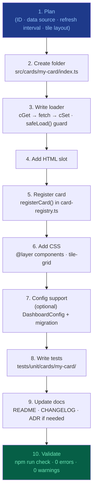

# 🧩 Adding a New Card to FamilyDashBoard

This guide walks through every step needed to add a fully functional card to the
dashboard. Follow the steps in order — each builds on the previous.

## 🔄 Card Creation Flow



---

## 1. 📋 Plan the Card

Before writing any code decide:

- **Card ID** — lowercase kebab-case, e.g. `my-card`. This becomes the `data-card-id`
  attribute, the registry key, and the localStorage cache prefix.
- **Data source** — will data come from the Cloudflare Worker, a public API, or be
  purely local/static?
- **Refresh interval** — how often should data refresh? (common: 60 s, 300 s)
- **Tile layout** — card content must use a `display: grid` or `display: flex; flex-wrap: wrap`
  tile layout, not a plain vertical list (per rule 25).

---

## 2. 📁 Create the Card Folder

```text
src/cards/my-card/
  index.ts          ← loader: fetch, cache, render
  my-card.css       ← card-specific styles (optional)
```

---

## 3. ✍️ Write the Loader (`index.ts`)

Minimal template:

```typescript
import { cGet, cSet, cGetStale } from "@/core/cache";
import { setSync } from "@/core/sync";
import { diagLog } from "@/core/diag";
import { fetchWithTimeout } from "@/core/fetch";

const CARD_ID = "my-card";
const CACHE_KEY = "my_card_data";
const CACHE_TTL = 300; // seconds

let _pageVisible = true;
export function setPageVisible(v: boolean) {
  _pageVisible = v;
}

export async function loadMyCard(): Promise<void> {
  if (!_pageVisible) return;

  const cached = cGet<MyCardData>(CACHE_KEY, CACHE_TTL);
  if (cached !== null) {
    render(cached);
    return;
  }

  setSync(CARD_ID, "loading");
  try {
    const res = await fetchWithTimeout("https://api.example.com/data", 8000);
    const data = (await res.json()) as MyCardData;
    cSet(CACHE_KEY, data);
    render(data);
    setSync(CARD_ID, "ok");
  } catch (err) {
    diagLog(`${CARD_ID}: fetch failed`, err);
    const stale = cGetStale<MyCardData>(CACHE_KEY);
    if (stale !== null) render(stale);
    setSync(CARD_ID, "error");
  }
}

function render(data: MyCardData): void {
  const el = document.getElementById("my-card-content");
  if (!el) return;
  // Use textContent, never innerHTML with unsanitized data.
  el.textContent = data.value;
}
```

Key rules to follow:

- `cGet`/`cSet`/`cGetStale` — never roll your own cache.
- `setSync(id, state)` — not `setSyncStatus()`.
- `if (!_pageVisible) return;` at the top of every loader.
- All fetches wrapped in `try/catch` with `diagLog()`.
- `textContent` for DOM updates with external data.

---

## 4. 🧱 Add the HTML Slot

Open `src/index.html` and add the card element in the correct grid region:

```html
<fdb-card data-card-id="my-card" data-label="My Card">
  <div id="my-card-content" class="tile-grid"></div>
</fdb-card>
```

The `data-card-id` value must match the registry ID exactly (kebab-case, no aliases).

---

## 5. 📝 Register the Card

Open `src/core/card-registry.ts` and register the new card:

```typescript
import { loadMyCard } from "@/cards/my-card";

registerCard({
  id: "my-card",
  label: "My Card",
  load: loadMyCard,
  intervalMs: 300_000,
});
```

---

## 6. 🎨 Add CSS

In `src/cards/my-card/my-card.css` (or in `src/styles/components.css`):

```css
@layer components {
  .my-card-grid {
    display: grid;
    grid-template-columns: repeat(auto-fit, minmax(180px, 1fr));
    gap: var(--space-2);
  }
}
```

Import it in `src/main.ts` or directly in `index.ts` (Vite handles CSS imports).

---

## 7. ⚙️ Add Config Support (optional)

If the card has user-configurable settings:

1. Add the field(s) to `DashboardConfig` in `src/types/config.ts`.
2. Add defaults to `DEFAULT_CONFIG`.
3. Bump `configVersion` by 1.
4. Add a migration entry in `src/core/config.ts` (see ADR-009).
5. Wire the config field to the config panel in `src/ui/config-auto-render.ts`.

---

## 8. 🧪 Write Tests

Create `tests/unit/cards/my-card/my-card.test.ts`:

```typescript
import { describe, it, expect, vi, beforeEach, afterEach } from "vitest";
import { createCardDOM, cleanupDOM, createMockFetch, createMockCache } from "@tests/helpers";

describe("my-card", () => {
  beforeEach(() => cleanupDOM());
  // ...
});
```

Run: `npx vitest run tests/unit/cards/my-card/`

---

## 9. 📄 Update Documentation

- Add the card to the **Cards** table in `README.md`.
- Add a one-line entry in `CHANGELOG.md` under the `[Unreleased]` section.
- If the card introduces a new architectural pattern, consider an ADR in `docs/adr/`.

---

## 10. ✅ Validate

```powershell
npx tsc --noEmit
npx eslint src tests --max-warnings 0
npx vitest run
npx vite build
node scripts/check-bundle-size.mjs
node scripts/check-sw-version.mjs
```

All must pass with 0 errors, 0 warnings, 0 test failures before committing.

---

## 📺 Video-Card Variant

Cards that display a live video stream follow a distinct pattern from data-polling cards.
Use this section alongside the standard steps above.

### Key differences

| Aspect         | Data card                            | Video-card                                               |
| -------------- | ------------------------------------ | -------------------------------------------------------- |
| DOM element    | `<article>` with tile grid           | `<article>` wrapping `<video>` + overlay                 |
| Data fetching  | `cGet` / `cSet` / `fetchWithTimeout` | `StreamDescriptor` from `video-news-adapter.ts`          |
| State          | `cGet()` / `cSet()` cache            | Module-level `_muted`, `_activeChannel`, retry state     |
| Refresh        | Polling interval                     | HLS manifest (no-store); `onerror` retry with back-off   |
| CSP            | `connect-src` only                   | `connect-src` + `media-src` + `blob:`                    |
| Autoplay       | N/A                                  | Always `muted` by default; play-prompt overlay on block  |
| Reduced motion | N/A                                  | Pause + show poster on `prefers-reduced-motion: reduce`  |
| Testing        | Unit + integration                   | Unit (adapter) + integration (404 fallback) + Playwright |

### `StreamDescriptor` type

Every channel is described by a `StreamDescriptor` (see `src/types/stream.ts`):

```typescript
interface StreamDescriptor {
  id: VideoChannelId; // "c14" | "i24" | "now14" | "arutz7"
  url: string; // HLS manifest URL (or "" if pending)
  mode: "hls-native" | "hls-worker" | "hls-js" | "iframe";
  titleHe: string; // Hebrew channel name
  poster: string; // Poster image URL (shown while loading)
  cspHosts: { connect: string[]; media: string[] }; // hosts for CSP extension
}
```

Implement `getStreamDescriptor(id)` in a `*-adapter.ts` file alongside the card.

### Accessibility requirements

- `<video aria-label="<channel> שידור חי — מושתק">` — update on channel switch
- Mute button: `<button aria-pressed="true|false">` — announce state change
- Keyboard shortcuts `M` (mute) and `V` (cycle channel) documented in `docs/keyboard.md`
- `prefers-reduced-motion`: pause video + show poster + `aria-live` announcement

### CSP documentation requirement

Before the card ships:

1. Add all stream hosts to the `connect-src` / `media-src` allow-list in `src/index.html`
2. Document the new hosts in `docs/security.md` (see the "Video Streams" section)
3. Cross-reference ADR-019 in the card's source file header comment

### Registration

Register with `hidden: true` so the card is opt-in:

```typescript
registerCard({
  id: "my-video-card",
  tagName: "fdb-my-video-card",
  defaultSlot: { col: 1, order: 99, flexGrow: 25, hidden: true },
});
```

### See also

- `src/cards/video-news/` — reference implementation
- `docs/adr/ADR-019-video-card-csp.md` — CSP + provider integration modes
- `docs/security.md#10-video-streams` — host allow-list documentation
- `docs/keyboard.md` — `M` / `V` keyboard shortcuts
