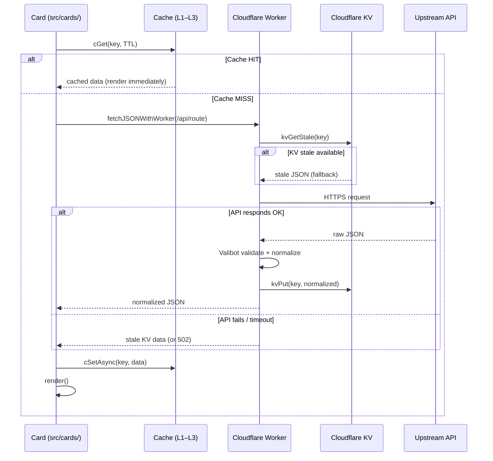

# Data Sources

> Last updated: v12.5.0

This document describes every external data source used by FamilyDashBoard, its
caching strategy, worker route, and known failure modes.

---

## Architecture Overview

All production data flows through the Cloudflare Worker at
`https://fdb.rajwanyair.workers.dev`. The worker validates upstream responses
with **Valibot** schemas and normalises them before returning them to the client.

Fallback chain (dev / file:// only — `__USE_PROXIES__=true`):
Direct → allorigins → codetabs → corsproxy.io

---

## Card-by-Card Data Source Reference

### 🌤 Weather — `open-meteo`

| Property          | Value                                                         |
| ----------------- | ------------------------------------------------------------- |
| Provider          | [Open-Meteo](https://open-meteo.com/) — free, no key required |
| Worker route      | `GET /api/weather?lat=X&lon=Y`                                |
| Upstream URL      | `https://api.open-meteo.com/v1/forecast`                      |
| Valibot schema    | `WeatherSchema` in `worker/src/utils/schemas.ts`              |
| Cache TTL         | 30 min (`INTERVALS.WEATHER`)                                  |
| Cache key         | `wx`                                                          |
| Stale fallback    | `cGetStaleAsync("wx")` in `open-meteo-adapter.ts`             |
| KV stale fallback | Yes (`data.ts` — `handleWeather`)                             |
| Failure mode      | Worker returns 502 if upstream shape is invalid               |

---

### 💱 Currency — `er-api`

| Property          | Value                                                                                                    |
| ----------------- | -------------------------------------------------------------------------------------------------------- |
| Provider          | [ExchangeRate-API](https://www.exchangerate-api.com/) (ILS base)                                         |
| Worker route      | `GET /api/currency`                                                                                      |
| Upstream URL      | `https://v6.exchangerate-api.com/v6/<KEY>/latest/ILS` + `https://open.er-api.com/v6/latest/ILS` fallback |
| Valibot schema    | `CurrencySchema` in `worker/src/utils/schemas.ts`                                                        |
| Cache TTL         | 1 hour (`INTERVALS.CURRENCY`)                                                                            |
| Cache key         | `curr`                                                                                                   |
| KV stale fallback | Yes (`data.ts` — `handleCurrency`)                                                                       |
| Failure mode      | Worker returns 502 on shape mismatch                                                                     |

---

### 📈 Stocks — `yahoo-finance`

| Property       | Value                                                                                        |
| -------------- | -------------------------------------------------------------------------------------------- |
| Provider       | Yahoo Finance v8 chart API (unofficial, no key required)                                     |
| Worker route   | `GET /api/stocks?sym=AAPL`                                                                   |
| Upstream URL   | `https://query1.finance.yahoo.com/v8/finance/chart/<sym>`                                    |
| Valibot schema | `StocksChartSchema` in `worker/src/utils/schemas.ts`                                         |
| Cache TTL      | 5 min open, 30 min closed (`INTERVALS.STOCKS_OPEN/CLOSED`)                                   |
| Cache key      | `stk-<SYM>`                                                                                  |
| Stale fallback | `cGetStale` on error                                                                         |
| Failure mode   | Worker returns 502 if shape invalid                                                          |
| Known risk     | Unofficial API — may break without notice. Use `StocksChartSchema` to detect breakage early. |

**BTC-USD special case**: Bitcoin uses `GET /api/crypto` (CoinGecko) since Yahoo
Finance crypto quotes are unreliable in browser CORS contexts.

---

### ₿ Bitcoin — `coingecko`

| Property       | Value                                                                   |
| -------------- | ----------------------------------------------------------------------- |
| Provider       | [CoinGecko](https://www.coingecko.com/) — free tier                     |
| Worker route   | `GET /api/crypto?ids=bitcoin&vs_currencies=usd`                         |
| Upstream URL   | `https://api.coingecko.com/api/v3/simple/price`                         |
| Valibot schema | `CoinGeckoSchema` in `worker/src/utils/schemas.ts`                      |
| Cache TTL      | 5 min (`Cache-Control: max-age=300` on worker response)                 |
| Cache key      | (stock cache key `stk-BTC-USD`)                                         |
| Failure mode   | Worker returns 502 if schema invalid; 400 if unsupported coin requested |
| Note           | Only `bitcoin` is accepted by the worker (`ids` allowlist)              |

---

### 📰 News — RSS feeds

| Property       | Value                                                                                                                                                                            |
| -------------- | -------------------------------------------------------------------------------------------------------------------------------------------------------------------------------- |
| Provider       | 17 RSS feeds (Ynet, Walla, Mako, Kan, N12, Rotter, Israel Hayom, Globes, Calcalist, Makor Rishon, Kikar HaShabbat, ICE, Geektime, Channel 14, Arutz 7, Srugim, Behadrei Haredim) |
| Worker route   | `GET /api/news?url=<encoded-rss-url>`                                                                                                                                            |
| Upstream       | Direct RSS proxy (allowlisted origins only) — tried **first** before proxy chain                                                                                                 |
| Cache TTL      | 15 min (`INTERVALS.NEWS`)                                                                                                                                                        |
| Cache key      | `news-<hash>`                                                                                                                                                                    |
| Stale fallback | `cGetStale` on error                                                                                                                                                             |
| Time display   | Each item: `.news-pub-time` (HH:MM / אתמול HH:MM / DD/MM HH:MM) + `.news-age` (MM:SS / HH:MM:SS / D:HH:MM:SS)                                                                    |
| Failure mode   | Worker returns 403 if origin not in `ALLOWED_NEWS_ORIGINS`                                                                                                                       |

---

### 📅 Hebrew Calendar — `hebcal`

| Property          | Value                                                             |
| ----------------- | ----------------------------------------------------------------- |
| Provider          | [Hebcal](https://www.hebcal.com/) — free, no key required         |
| Worker routes     | `GET /api/hebcal?geonameid=X`, `GET /api/hebcal/holidays?year=X`  |
| Valibot schemas   | `HebcalSchema`, `HebcalHolidaysSchema`                            |
| Cache TTL         | 6 hours (`INTERVALS.HEBREW_CAL`)                                  |
| Cache key         | `hcal`, `hcal-holidays-<year>`                                    |
| KV stale fallback | Yes (`data.ts` — `handleHebcal`, `handleHebcalHolidays`)          |
| Additional data   | Parasha, Omer, Zmanim, Daf Yomi, Candles/Havdala — all via Hebcal |

---

### 🗓 Calendar — Google ICS

| Property     | Value                                                                                 |
| ------------ | ------------------------------------------------------------------------------------- |
| Provider     | Google Calendar (ICS export)                                                          |
| Worker route | `GET /api/calendar?url=<encoded-ics-url>` — tried **first** before direct/proxy chain |
| Upstream     | ICS URL (allowlisted origins: `google.com`, `apple.com`, etc.)                        |
| Cache TTL    | 15 min (`INTERVALS.CALENDAR`)                                                         |
| Cache key    | `cal-ics-<index>`                                                                     |
| Validation   | Server validates `BEGIN:VCALENDAR` presence                                           |
| Failure mode | Worker returns 403 if origin not in `ALLOWED_CALENDAR_ORIGINS`, 502 if not valid ICS  |

---

### 🚨 Alerts — Tzeva Adom

| Property          | Value                                           |
| ----------------- | ----------------------------------------------- |
| Provider          | [tzevaadom.co.il](https://www.tzevaadom.co.il/) |
| Worker route      | `GET /api/alerts`                               |
| Upstream URL      | `https://api.tzevaadom.co.il/alerts-history`    |
| Cache TTL         | 1 min (`INTERVALS.ALERTS_ACTIVE`)               |
| Cache key         | `alerts`                                        |
| Response envelope | `workerEnvelope(data, "tzevaadom", false, 60)`  |
| Failure mode      | Worker returns 502 on upstream error            |

---

### 💡 Motivation — Sefaria

| Property      | Value                                                      |
| ------------- | ---------------------------------------------------------- |
| Provider      | [Sefaria](https://www.sefaria.org/) — free, no key         |
| Worker routes | `GET /api/sefaria/calendar`, `GET /api/sefaria/text?ref=X` |
| Cache TTL     | 24 hours (`INTERVALS.HALACHA`)                             |
| Cache key     | `sefaria-cal`, `sefaria-text-<ref>`                        |
| Failure mode  | Returns stale or empty on error                            |

---

### 🗒 Tasks

Tasks data is stored locally (localStorage) — no external API.

---

### 💻 System Info

System info (battery, memory, etc.) uses the browser's built-in `navigator`
and `performance` APIs — no external API.

---

### ⏳ Countdown

Countdown is configured locally (target date/time) — no external API.

---

## Adding a New Data Source

See [adding-a-card.md](adding-a-card.md) for the step-by-step guide.

Key checklist:

1. Add a Zod schema in `worker/src/utils/schemas.ts`
2. Add a route handler in `worker/src/routes/feeds.ts` or `data.ts`
3. Register the route in `worker/src/index.ts`
4. Add a route entry to `worker/openapi.yaml`
5. Map the upstream URL in `buildWorkerRoute()` in `src/core/fetch.ts`
6. Add a provider adapter in `src/cards/<card>/<card>-adapter.ts`
7. Add tests in `tests/unit/worker/worker.test.ts` (schema + route)
8. Update this file

---

## Rate Limiting

All worker routes share a per-IP rate limit (configured in
`worker/src/middleware/rate-limit.ts`). Clients receive
`X-RateLimit-Limit` and `X-RateLimit-Remaining` headers on every response.
Exceeding the limit returns HTTP 429.
