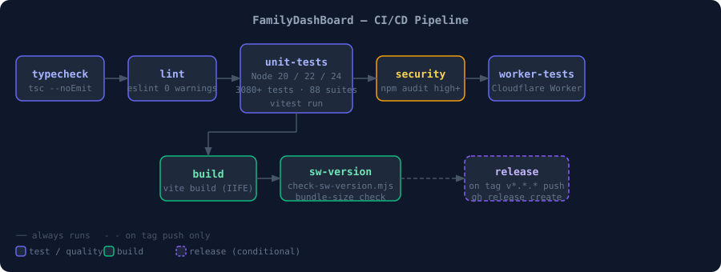

# 🚀 Deployment Guide — FamilyDashBoard

FamilyDashBoard is a static PWA. There is no server to run; you just serve the
compiled `dist/` folder from any static host.



---

## 🏗️ Build Targets

### 📄 GitHub Pages (default)

```powershell
npm run build
```

- Sets `--base /FamilyDashBoard/` so all asset paths are relative to the repo root.
- Output: `dist/`

### 💾 Local `file://` access

```powershell
npm run build:local
```

- Sets `--base ./` so assets resolve from the same directory.
- Bundles a single IIFE (no `type="module"`) so the page works without a web server.
- Output: `dist/`

---

## 🔐 Reproducibility and Rollback Drill

Before publishing a release, compare two clean builds from the same commit.
Keep the evidence outside the repository so generated reports do not become
working-tree changes:

```powershell
$evidence = Join-Path $env:TEMP "FamilyDashBoard\s07-r2"
$env:SOURCE_DATE_EPOCH = (git show -s --format=%ct HEAD).Trim()
New-Item -ItemType Directory -Force $evidence | Out-Null
Remove-Item -LiteralPath "dist" -Recurse -Force -ErrorAction SilentlyContinue
npm run build
Copy-Item -LiteralPath "dist" -Destination (Join-Path $evidence "build-a") -Recurse -Force
Remove-Item -LiteralPath "dist" -Recurse -Force
npm run build
Copy-Item -LiteralPath "dist" -Destination (Join-Path $evidence "build-b") -Recurse -Force
node scripts/check-reproducible.mjs --compare `
  (Join-Path $evidence "build-a") (Join-Path $evidence "build-b")
Remove-Item Env:SOURCE_DATE_EPOCH
```

The fixed commit timestamp makes the build-time diagnostic value deterministic.
Release packaging also normalizes extracted-file timestamps and sorts the
archive input list, so the published `dist.zip` can be compared with an
independent rebuild. The directory comparison is content-based, sorts paths,
and ignores only generated reproducibility manifests. A mismatch is a release
blocker; do not update a baseline or publish an artifact to make the hashes
agree.

The independent rebuilder downloads `dist.zip`, `sw.js`, both Cosign bundles,
the published checksum file, and `sbom.json`. It then runs
[`scripts/verify-release-provenance.mjs`](../scripts/verify-release-provenance.mjs)
with the exact repository, `release.yml` workflow, `refs/tags/<tag>` identity,
and `https://token.actions.githubusercontent.com` issuer. The verifier checks
both SHA-256 entries, validates the CycloneDX root component and dependency
graph against a fresh SBOM from the checked-out tag, verifies that `dist.zip`
matches the independent rebuild, verifies the GitHub SLSA attestation with
`gh attestation verify`, and requires Cosign verification for both artifacts.
It also proves that tampered content, a different certificate identity, and a
missing bundle are rejected. A release is not accepted when any of these
checks fails.

For rollback, retain the last known-good `dist.zip`, publish that artifact to
the static host, and confirm the Service Worker update path. Do not clear
`localStorage`, delete IndexedDB, or ask operators to reset configuration as a
first recovery step. After the prior artifact is active, verify that cached
card data, settings, and export/import still work, then investigate the failed
release build before retrying publication.

## 🌐 Deploying to GitHub Pages

The repository ships a `.github/workflows/release.yml` that builds and attaches
`dist.zip` to every tagged release. GitHub Pages is configured to deploy from the
`gh-pages` branch (or the `main` branch `docs/` folder — check repository Settings →
Pages).

Manual trigger:

1. Push a version tag: `git tag v8.1.0 ; git push origin main --tags`
2. The `Release` workflow builds, runs tests, and creates a GitHub Release with
   `dist.zip` attached.
3. GitHub Pages automatically deploys from the source configured in repository settings.

---

## 🏠 Self-Hosting (any static server)

1. Build: `npm run build` (or `build:local` for file:// access).
2. Copy `dist/` to your server's web root.
3. Serve with any HTTP server — nginx, Apache, Caddy, `npx serve dist/`, etc.
4. Ensure `sw.js` is served from the same origin as `index.html` (required for the
   Service Worker to register correctly).

### ⚙️ nginx example

```nginx
server {
    listen 80;
    root /var/www/familydashboard/dist;
    index index.html;

    location / {
        try_files $uri $uri/ /index.html;
    }

    # Service Worker must not be cached by the browser long-term.
    location = /sw.js {
        add_header Cache-Control "no-store, no-cache, must-revalidate";
    }
}
```

---

## ☁️ Deploying the Cloudflare Worker (optional)

The Worker (`worker/`) is optional — the dashboard works without it, falling back to
the client-side proxy chain for external API data.

```powershell
# From the worker/ directory
cd worker
npm install
npx wrangler deploy
```

Set the `WORKER_URL` environment variable (or the `workerUrl` config field) to your
Worker's `*.workers.dev` URL so the dashboard routes fetches through it.

See `worker/README.md` and `worker/API.md` for full Worker documentation.

---

## ⚙️ Environment / Configuration

FamilyDashBoard has no server-side environment variables. All configuration is stored
in the user's `localStorage` and managed through the in-app config panel (`S` key or
the ⚙️ button).

API keys for premium data providers (e.g., OpenWeatherMap) are entered directly in
the config panel and stored locally — they are never transmitted to any FamilyDashBoard
server.

---

## 🔧 Service Worker

The Service Worker (`sw.js`) pre-caches the app shell on first load and serves cached
responses offline. It broadcasts a `VERSION_ACTIVATED` message when a new version
activates. The dashboard listens for this and prompts the user to reload.

To force a SW update during development: open DevTools → Application → Service Workers
→ click "Update".

---

## 📴 Offline Mode

When offline, the Service Worker serves the last-cached `index.html`. Cards that
cannot reach their APIs display stale data from `localStorage` cache if available, or
a graceful error tile otherwise.

---

## 🔍 Troubleshooting

| Symptom                   | Fix                                                        |
| ------------------------- | ---------------------------------------------------------- |
| Blank page after deploy   | Check `--base` flag matches your deployment path           |
| SW not registering        | Ensure `sw.js` is at the same origin as `index.html`       |
| Old version still showing | Hard-reload (`Ctrl+Shift+R`) or clear the SW in DevTools   |
| API data not loading      | Open diagnostics (`D` key) to see the fetch log            |
| Cards hidden unexpectedly | Config is stored in localStorage — open config panel (`S`) |
