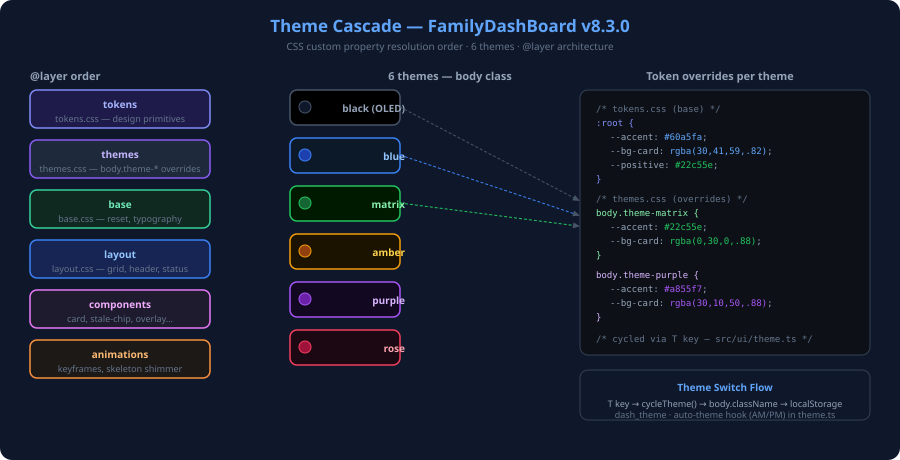

# 🎨 Theme Gallery

> FamilyDashBoard ships **7 dark themes** — all CSS custom-property-driven, zero
> runtime dependencies. Switch via **Settings ⚙ → Theme** or keyboard **`T`** (cycles) · `Shift+T` (reverse).



## 🌈 Themes

| #   | Name                  | CSS Class             | Accent               | Background             | Best For                                     | VR Baseline |
| --- | --------------------- | --------------------- | -------------------- | ---------------------- | -------------------------------------------- | ----------- |
| 1   | **True Black (OLED)** | `theme-black`         | Warm gold `#c8a87a`  | Pure black `#000`      | OLED TVs — deep blacks, zero backlight bleed | [black-tv](../tests/e2e/visual-regression.spec.ts-snapshots/black-tv-chromium-win32.png) |
| 2   | **Ocean Blue**        | `theme-blue`          | Sky blue `#82b8d8`   | Deep navy `#0c1824`    | Default — calm, easy on the eyes             | [blue-tv](../tests/e2e/visual-regression.spec.ts-snapshots/blue-tv-chromium-win32.png) |
| 3   | **Forest Green**      | `theme-matrix`        | Soft green `#86c490` | Dark forest `#0e1a10`  | Nature vibe, hacker aesthetic                | [matrix-tv](../tests/e2e/visual-regression.spec.ts-snapshots/matrix-tv-chromium-win32.png) |
| 4   | **Amber Glow**        | `theme-amber`         | Warm amber `#c8a07c` | Dark brown `#18120a`   | Night mode, warm tint, retro feel            | [amber-tv](../tests/e2e/visual-regression.spec.ts-snapshots/amber-tv-chromium-win32.png) |
| 5   | **Purple Dusk**       | `theme-purple`        | Lavender `#b8aad4`   | Deep purple `#140e1e`  | Evening vibes, creative setup                | [purple-tv](../tests/e2e/visual-regression.spec.ts-snapshots/purple-tv-chromium-win32.png) |
| 6   | **Rose Night**        | `theme-rose`          | Soft rose `#c08898`  | Dark crimson `#180a0e` | Romantic aesthetic, warm accent              | [rose-tv](../tests/e2e/visual-regression.spec.ts-snapshots/rose-tv-chromium-win32.png) |
| 7   | **High Contrast**     | `theme-high-contrast` | Yellow `#ffdd00`     | Pure black `#000`      | Accessibility (WCAG AAA), vision impairments | *(VR pending — no snapshot yet)* |

> **VR baselines** are stored in `tests/e2e/visual-regression.spec.ts-snapshots/` and updated by
> running `npx playwright test tests/e2e/visual-regression.spec.ts --update-snapshots`.
> The high-contrast theme (added in [ADR-074](adr/ADR-074-high-contrast-theme.md)) does not yet
> have a VR baseline — add one before v15.

## 🎨 Per-Theme Visual Properties

### 1. True Black (OLED) — `theme-black`

Pure `#000000` background eliminates backlight bleed on OLED displays (LG OLED C series,
Samsung QD-OLED, Sony Bravia). Cards appear to float on the screen. Warm gold accents
(`#c8a87a`) create a premium, minimalist aesthetic. Ideal for home-theater setups with
ambient lighting off.

### 2. Ocean Blue — `theme-blue` *(Default)*

The default theme. Deep navy background (`#0c1824`) with sky blue accents (`#82b8d8`)
mimics a deep-sea palette. Calm and readable at TV viewing distance (3 m). Recommended
for most living-room deployments. All screenshots in docs use this theme.

### 3. Forest Green — `theme-matrix`

Inspired by terminal interfaces and forest environments. Dark forest background (`#0e1a10`)
with soft green accents (`#86c490`). Natural, low-blue-light palette suitable for
evening use. The name "matrix" reflects the monochrome-green hacker-terminal aesthetic.

### 4. Amber Glow — `theme-amber`

Warm amber (`#c8a07c`) on dark brown (`#18120a`) reduces blue-light exposure at night.
The palette mimics incandescent lighting and is subjectively the most comfortable for
late-night viewing. Positive/negative indicators adjust to amber/red to preserve the
warm palette.

### 5. Purple Dusk — `theme-purple`

Deep purple background (`#140e1e`) with lavender accents (`#b8aad4`). Evocative of
twilight. Well-suited to offices with purple neon or LED accent lighting. Creates a
studio / broadcast aesthetic.

### 6. Rose Night — `theme-rose`

Deep crimson background (`#180a0e`) with soft rose accents (`#c08898`). The most
distinctive palette — warm and intimate. Works well in bedrooms or with candle-lit
ambient lighting. The lowest-contrast theme; if readability is a concern, prefer
Ocean Blue or High Contrast.

### 7. High Contrast — `theme-high-contrast`

Designed to meet **WCAG 2.2 AAA** contrast requirements. Pure black background (`#000`)
with maximum-contrast yellow accents (`#ffdd00`). Card headers use white text on dark
background at ≥ 7:1 contrast ratio. This theme is also activated automatically when
the OS reports `prefers-contrast: more`. See [ADR-074](adr/ADR-074-high-contrast-theme.md).

## 🏗️ Design Principles

- **All themes are dark** — the dashboard is designed for always-on TV/monitor
  display where light themes cause eye strain and backlight bleed
- **No hardcoded colors** — every color uses CSS custom properties (`--accent`,
  `--bg-card`, `--positive`, `--negative`, etc.)
- **Semantic tokens** — `--positive` (green), `--negative` (red), `--warning`
  (yellow/amber) are theme-aware for stocks, alerts, and status indicators
- **View Transitions** — theme switching uses the View Transitions L2 API for
  smooth cross-fade when supported

## 🧱 CSS Architecture

Themes live in `@layer themes` inside `src/styles/themes.css`. Each theme sets
these custom properties on `body.theme-{name}`:

```text
--bg-primary        Main background
--bg-card           Card body background
--bg-card-header    Card header background
--bg-card-inner     Inner tile/cell background
--bg-card-hover     Card hover state
--accent            Primary accent color
--accent-bright     Lighter accent variant
--accent-glow       Glow/shadow accent (translucent)
--accent-border     Border accent (translucent)
--card-border       Full border declaration (width + style + color)
--card-shadow       Box shadow declaration
--bg-gradient-1/2/3 Subtle background gradient overlays
--text-muted        Secondary text color
--positive          Success/gain color (green family)
--negative          Error/loss color (red family)
--warning           Warning/caution color (yellow/amber family)
```

## 🌅 Auto-Theme

When **Auto-Theme** is enabled in settings, the dashboard switches between a
configured day theme and night theme based on sunrise/sunset times for the
user's location. This prevents a bright theme during dark hours.

## ♿ OS High-Contrast Override

In addition to the explicit high-contrast theme, the dashboard respects
`@media (prefers-contrast: more)` — boosting borders, muting backgrounds, and
increasing text contrast regardless of the selected theme.

## ➕ Adding a New Theme

1. Add the theme name to the `THEMES` array in `src/core/constants.ts`
2. Add the CSS block in `src/styles/themes.css` inside `@layer themes`
3. Add a `<option>` to `#theme-select` in `src/index.html`
4. Update tests that iterate `THEMES` (they auto-detect via the array)
5. Update this document

See [ADR-074](adr/ADR-074-high-contrast-theme.md) for the high-contrast theme
decision record.
